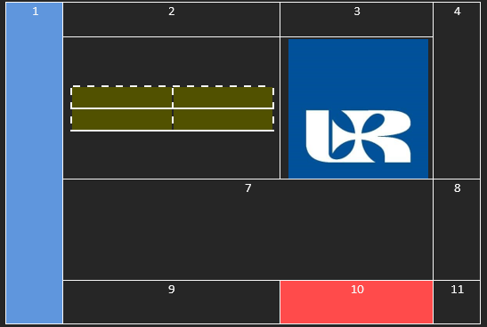
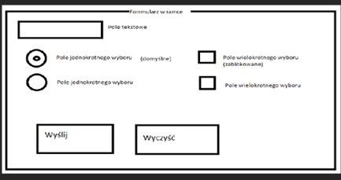

# Kolokwium gr I 
### 1.	Stwórz plik index.html i zapisuj tam wszystkie zadania. 
### 2.	Pamiętaj aby całą zawartość strony formatować CSS.
### 3.	Atrybuty strony: tło żółte, margines górny i dolny 10px, margines prawy i lewy 5px. 
### 4.	Stwórz tabelę 

<br>

### 5.	Stwórz listę 
```
A.	Pierwsza pozycja 

B.	Druga pozycja 

  7.	Pierwsza pozycja 
  
  8.	Druga pozycja
     
    a.	Pierwsza pozycja

    b.	Druga pozycja 
    
C.	Trzecia pozycja
```

### 6.	Stwórz formularz 

<br>
 
### 7.	Stwórz link:
•	Przed najechaniem: Arial; 20px; czarna
•	W trakcie najechania: Verdana; 100px; czerwona
•	Po kliknięciu: Verdana; 20px; szara; brak podkreślenia
LINK ma prowadzić do strony: [link](http://www.onet.pl)
