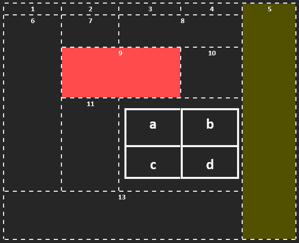
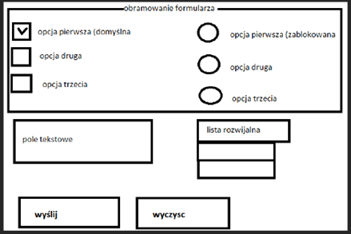

# [Kolokwium gr II](https://techint.dawidolko.pl/KOLOKWIUM/Kolokwium1v2/kolokwium2/)

### 1.	Stwórz plik index.html i zapisuj tam wszystkie zadania. 
### 2.	Pamiętaj aby całą zawartość strony formatować CSS.
### 3.	Atrybuty strony: tło szare, margines prawy i dolny 50px, margines dolny i lewy 20px, czcionka Verdana – żółta, 12px; 
### 4.	Stwórz tabelę 

 <br>
 
### 5.	Stwórz listę 

```
A.	Pozycja pierwsza 
B.	Pozycja druga 
  7. Pozycja pierwsza 
  9. Pozycja druga 
    I.	Pozycja pierwsza 
    II.	Pozycja druga 
      •	Pozycja pierwsza 
  11. Pozycja trzecia 
C.  Pozycja trzecia 
```
 	 
### 6.	Stwórz formularz 

<br>
 
### 7.	Stwórz link:
•	Przed najechaniem: Calibri; 20px; zielona 
•	W trakcie najechania: Calibri; 100px; czerwona
•	Po kliknięciu: Arial; 20px; szara; brak podkreślenia
LINK ma prowadzić do strony: [link](http://www.interia.pl)
 
 	 
