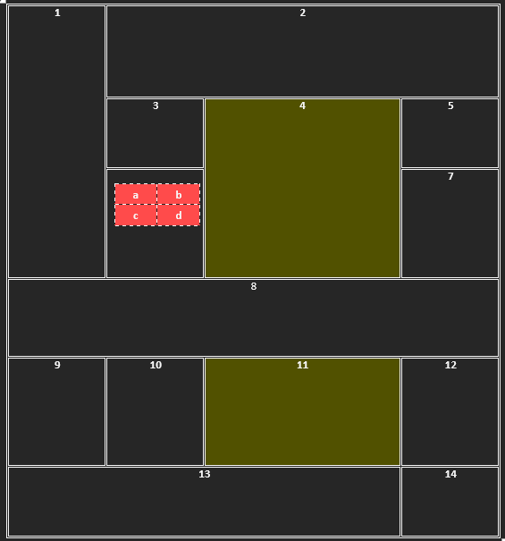

# [Kolokwium gr III](https://techint.dawidolko.pl/KOLOKWIUM/Kolokwium1v3/kolokwium3/)
### 1.	Stwórz plik index.html i zapisuj tam wszystkie zadania. 
### 2.	Pamiętaj aby całą zawartość strony formatować CSS.
### 3.	Atrybuty strony: tło zielone, marginesy wszystkie 100px, czcionka Verdana – czerwona, 15px, pochyła
### 4.	 Stwórz tabelę 

<br>
 
### 5.	Stwórz listę 
 ```
•Pierwsza pozycja 
  7.	Pierwsza pozycja 
  8.	Druga pozycja 
  10. Trzecia pozycja 
    a.	Pierwsza pozycja 
    b.	Druga pozycja 
      I.	Pierwsza pozycja 
      II.	Druga pozycja 
    c.	Trzecia pozycja 
  11. Czwarta pozycja 
•Druga pozycja 
```
### 6.	Stwórz formularz 

<br>
 
### 7.	  Stwórz link:
•	Przed najechaniem: Arial; 20px; żółta 
•	W trakcie najechania: Arial; 100px; czerwona
•	Po kliknięciu: Verdana; 20px; szara; brak podkreślenia
LINK ma prowadzić do strony: [link](http://www.ur.edu.pl) 
