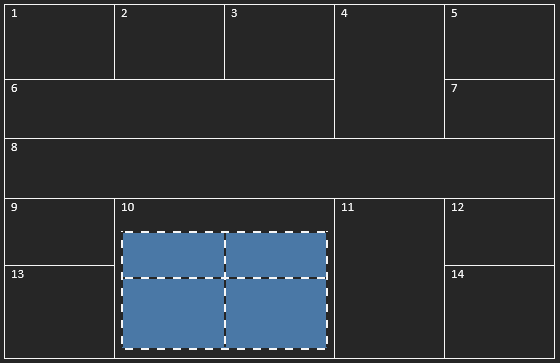
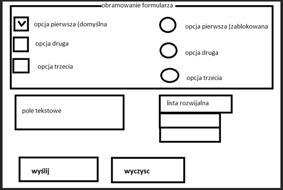
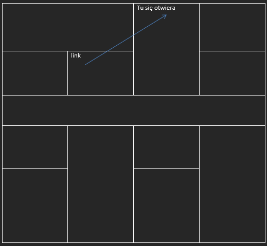

# Kolokwium gr I

Strona „pierwsza.html”

1.	Atrybuty strony: tło żółte, marginesy dolny i górny: 10%, prawy i lewy 20%, czcionka czerwona Arial, 12px, pogrubiona
   
2.	Stwórz tabelę

<br>

3.	Stwórz listę
```
A.Pierwsza pozycja
B.Druga pozycja
  7. pierwsza pozycja
  9. druga pozycja	
  	I. Pierwsza pozycja	
  	II. Druga pozycja
  12. Trzecia pozycja
    •	Pierwsza pozycja
    •	Druga pozycja
C.Trzecia pozycja
```
4.	Stwórz formularz

<br>

5. Strona „ramki.html”

- Stwórz ramki

<br>
