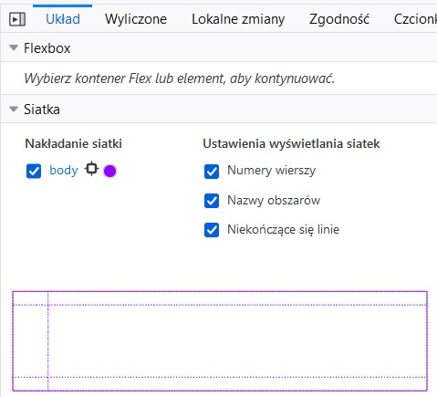
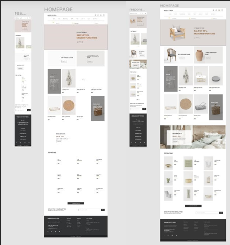
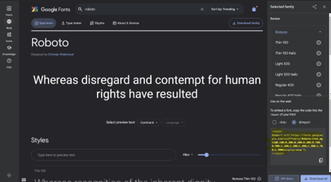
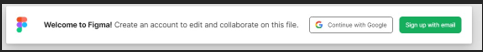
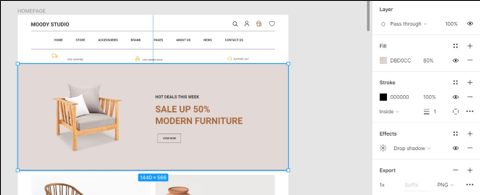
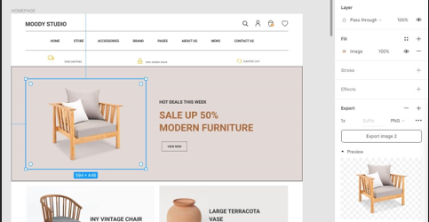
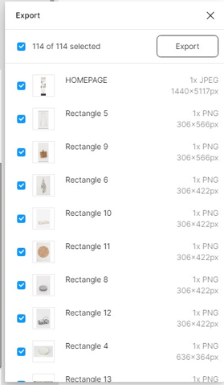
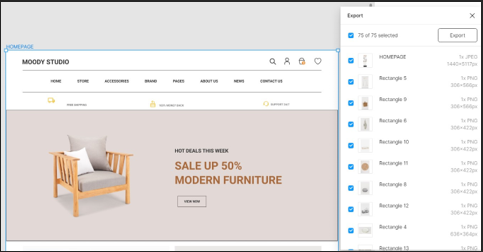

# Tworzenie złożonych układów treści, RWD 
 
## 1. Animacje CSS 
W przeszłości animacje na stronach internetowych wykonywano np. w Adobe Flash. W późniejszym okresie zaczęto również wykorzystywać do tego język JavaScript (poprzez napisanie skryptu, który dynamicznie tworzył i usuwał elementy HTML, z różnymi wartościami właściwości). 
Obecnie jednak zdefiniowanie wielu animacji jest natywnie wspierane przez CSS, a język JavaScript pełni tu pewną rolę pomocniczą (np. do triggerowania jakiejś animacji). 
Żeby jakiś element został animowany, należy ustawić mu właściwość animation-name. Następnie definiuje się at-rule @keyframes, która posiada tę nazwę jako swój identyfikator. Należy ustawić czas trwania animacji za pomocą właściwości `animation-duration`, która domyślnie ma wartość 0 (zatem animacja de facto się nie odtworzy). Jeżeli animacja ma mieć tylko dwa stany można wykorzystać właściwości from i to. W innym przypadku wykorzystuje się wartości procentowe od 0 do 100, które skądinąd odpowiadają wartościom from (odpowiednik 0%) i to (odpowiednik 100%). 
```
<!DOCTYPE html> 
<html> 
<head> <style> div {   width: 100px;   height: 100px; 
  background-color: rgb(0, 51, 160); /* kolor całego UR */   animation-name: example;   animation-duration: 15s; 
} 
@keyframes example { 
  0%   {background-color: rgb(128, 0, 0);} 
  25%  {background-color: rgb(104, 73, 28);} 
  50%  {background-color: rgb(127, 64, 112);} 
  100% {background-color: rgb(0, 102, 51);} 
} 
</style> 
</head> 
<body> 
<h1>Barwy Kolegiów Uniwersytetu Rzeszowskiego są następujące:</h1> <div></div> 
<p><b>Uwaga:</b> Kiedy animacja zakończy się, element powróci do swojego domyślnego stanu.</p> 
</body> 
</html> 
 ```
 
### [Zadanie 1.](https://techint.dawidolko.pl/LAB07/TASK1/) 
Napisz animację, która animuje logo Uniwersytetu Rzeszowskiego z wersji standardowej w monochromatyczną (załączone w assetach). Wykorzystaj właściwości `background-image` i `background-size`. 

•	Niech animacja wykonuje się nieskończoną ilość razy (właściwość `animation-iteration-count`) i trwa `6s`. Niech animowany będzie w ten sposób jeden `div`. 
 
•	Następnie dopisz animację, która po najechaniu na nią myszy powiększy rozmiar obrazka dwukrotnie i która trwa `2s`. Niech kolejny `div` posiada tę animację. 
 
•	Następnie dodaj jeszcze jeden element `div`, który wyjściowo również niech animuje się pomiędzy wersją monochromatyczną i barwną, ale po najechaniu myszą obraca się dodatkowo o `360 stopni`. 
 
•	Zastanów się, jak można za pomocą `animation-composition` połączyć działanie kilku animacji, bez konieczności pisania na nowo jednej animacji, będącej "sumą" kilku niezależnych animacji. 
 
### [Zadanie 2.](https://techint.dawidolko.pl/LAB07/TASK2/) 
Wykonaj za pomocą CSS następujący spinner: 
 
Wykorzystaj właściwość `animation-timing-function` aby animacja działała płynnie. 
 
### [Zadanie 3.](https://techint.dawidolko.pl/LAB07/TASK3/) 
Zapoznaj się z przykładem, który definiuje zdefiniowany samodzielnie (tj. przez autora strony) checkbox. Następnie dodaj animację, która po aktywacji `checkboxa`: 

•	powiększy go dwukrotnie 

•	ustawi kolor kursora na `zielony` 

•	będzie trwała `2s`, po czym dezaktywuje się 

Następnie dodaj do formularza przycisk typu submit, który będzie animowany w następujący sposób: 

•	obramowanie zmieni kolor na zielony 

•	przycisk powiększy się `120%` 

•	przycisk będzie okrągły i jako tekst pojawi się: `✔` 
 
### [Zadanie 4.](https://techint.dawidolko.pl/LAB07/TASK4/)  
Niech formularz z poprzedniego zadania dodatkowo wyświetla się w postaci animowanej, tzn. rozwija się dynamicznie podczas animowania. 
Skorzystaj z przykładu: [link](https://codepen.io/ma_suwa/pen/eYdZVML)
 
### [Zadanie 5.](https://techint.dawidolko.pl/LAB7/TASK5/) 
Zapoznaj się z przykładem `grid_areas.html`. W przykładzie tym zdefiniowano najpierw właściwość `grid-template-areas` w kontenerze głównym, po czym kolejne elementy otrzymały odpowiednią wartość właściwości `grid-area`.  
• W przeglądarce Firefox włącz następujący podgląd: 

<br>
  
i zobacz jak strona została podzielona na obszary. 

•	Wykorzystując jednostkę fr wymuś, aby kolumny były dokładnie sobie równe na szerokość 

•	Następnie (choć nie ma to tutaj za dużo sensu użytkowego) ustaw szerokość 1 kolumny na 5 razy większą niż drugiej. 

•	Powróć do stanu wyjściowego. Dopisz media query, które dla urządzeń mobilnych zmieni grid na jednokolumnowy z czterema wierszami. Niech grid-template-areas pozostaną takie jakie były, ale niech dostosują się do nowego układu. Niech również zarówno pasek nawigacyjny, jak i mapa strony będą zwijalne/rozwijalne. 
 
### [Zadanie 6.](https://techint.dawidolko.pl/LAB07/TASK6/)  
Popularnym elementem występującym na stronach internetowych jest `slider`. Jest to układ treści, w którym grupa elementów jest pokazywana trochę na podobieństwo pokazu slajdów (stąd nazwa), tj. jeden z elementów jest aktualnie widoczny, natomiast za pomocą przysików nawigacyjnych możliwa jest jego zmiana na kolejny. Podobnym rozwiązaniem jest carousel, gdzie jednocześnie widzimy kilka elementów i również za pomocą przycisków nawigacyjnych możemy przełączać na kolejne elementy, przy czym w carouselu zwykle nawigacja jest cykliczna, tj. ostatni element przełączy widok z powrotem na pierwszy. 

Poniżej zaprezentowano prosty slider: 

•	Zapoznaj się z przykładem i oceń, czy działa poprawnie zarówno w przeglądarce Fireox i Chrome. 

•	Wykonaj modyikację, w której zmienisz styl linków nawigacyjnych z postaci numerycznej na spotykane w tym kontekście zamalowywane kropki. 
 
### [Zadanie 7.](https://techint.dawidolko.pl/LAB07/TASK7/) 

Otwórz projekt wykonany w programie dla projektantów (ang. designerów) 

Figma: [link](https://www.figma.com/file/GFADyBwRyEVBCC4RvtRs8Z/MOODY-STORE-E-COMMERCE-WEB-SITE-(Community)-(Copy)?type=design&node-id=0-1&mode=design&t=XU2qVkNzGdqEft9o0). Na podstawie wykonanych do tej pory zadań wykonaj responsywną implementacje projektu poniżej zaprezentowanego fragmentu strony głównej na urządzenia mobilne i desktopy:  

<br>
  
Czcionkę 	Roboto 	używaną 	na 	stronie 	znajdziesz 	na 
[link](https://fonts.google.com/specimen/Roboto?query=roboto) 

<br>
  
W celu dostępu do pełnej wersji programu Figma: 

<br>
  
kliknij continue with Google, po czym skorzystaj z danych logowania do MS Teams (jest to jednocześnie konto Google). 

Przykładowo chcąc ustalić dokładną kolorystykę klikamy element: 

<br>
    
Jeżeli interesuje nas np. zdjęcie klikamy `ctrl` i klikamy na dany element: 
<br>
  
Użyteczny może być też skrót `ctrl + shift + e` (eksport wszystkich assetów): 

<br>
  
Jeżeli użyjemy go klikając na jakiś frame: 

<br>
 
