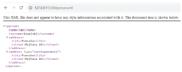
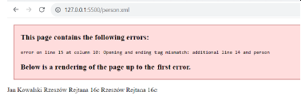
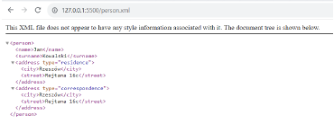
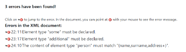
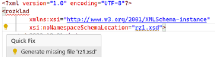
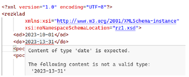

# XML (Extensible Markup Language) 

XML (ang. Extensible Markup Language) jest językiem, który powstał jako sposób na uproszczenie składni języka SGML, zachowując jednak jego główne możliwości (tj. możliwość definiowania dowolnych dokumentów i własnych znaczników). Składniowo przypomina on HTML (i co za tym idzie SGML), z tym, że w przeciwieństwie do niego nie posiada z góry zdefiniowanych znaczników, to raczej rolą programisty jest zdefiniować własne znaczniki, do których możliwe jest (ale nie jest wymagane) dołączenie DTD (Document Type Definition) albo XML Schema, jako czegoś w rodzaju gramatyki języka, która definiuje warunki, jakie dokument musi spełnić, aby być poprawnym.  Niektórzy rozpatrują XML jako meta-język, gdyż w pewnym sensie służy on do definiowania na jego bazie właściwych języków (tj. języków które obsługują już konkretny przypadek użycia, zastosowanie, modelują konkretny problem itd.). Używa się także określenia, że XML to format semistrukturalny, czyli że XML jednocześnie definiuje swoją strukturę i treść. 

XML od HTMLa odróżnia się dużo bardziej rygorystycznym podejściem do formatowania dokumentu. O ile HTML de facto (i właściwie de iure) jest "odporny" na popełnianie błędów składniowych, to parser XML zwykle od razu wyrzuca błąd parsowania i przerywa dalszą analizę dokumentu. Rozwiązanie to powoduje, że dużo łatwiej napisać poprawny parser XML i jest on znacznie lżejszy niż parser HTMLa, co ma znaczenie w niektórych zastosowaniach. 

XML często służy jako uniwersalny format do przesyłania informacji pomiędzy systemami informatycznymi (choć w tym kontekście jest obecnie wypierany przez JSON). 
Innym często stosowanym zastosowaniem XML są pliki konfiguracyjne. 

XML stał się też podstawą do definiowania dokumentów biurowych typu pakiet MS Office (Office Open XML) albo 
[OpenDocument](https://www.openoffice.org/xml/xml_specification.pdf). 

XML jest też stosowany do definiowania warstwy prezentacji zamiast/na wzór HTMLa w niektórych zastosowaniach (np. aplikacje natywne na Android, JavaFX).  
Załóżmy, że chcemy przechowywać informację o kliencie sklepu online. W celu wystawienia faktury trzeba znać jego imię i nazwisko oraz adres. Jednocześnie rozważana jest możliwość, że adres do korespondencji (dostarczenia przesyłki) jest inny niż taki, jaki ma się znaleźć na fakturze. 
Możliwe jest zamodelowanie tego problemu za pomocą np. takiego dokumentu XML. 

```xml
<?xml version="1.0" encoding="UTF-8"?>  
<person>  
    <name>Jan</name>  
    <surname>Kowalski</surname>  
    <address>  
        <city>Rzeszów</city>  
        <street>Rejtana 16c</street>  
    </address>  
    <address type="correspondence">  
        <city>Rzeszów</city>  
        <street>Rejtana 16c</street>  
    </address>  
</person>
```

•	Pierwsza linia zawiera deklarację XML o Deklaracja jest opcjonalna, jeśli programista/autor dokumentu nie poda deklaracji przyjmie ona domyślną wartość: 
`<?xml version="1.0" encoding="UTF-8" standalone="no" ?>`

o	Jej obecność ma na celu określenie wersji standardu XML oraz informacji dotyczących kodowania użytego do zapisania dokumentu. Ponadto, deklaracja może również zawierać informację dotyczącą tego, czy dany dokument zawiera odwołania do zewnętrznych źródeł danych. 

o	Najważniejsza jest tutaj wersja języka XML, jaką będziemy się posługiwać. 

•	Następnie w dokumencie występuje element person będący korzeniem dokumentu. 

o	Każdy poprawny dokument XML ma dokładnie jeden korzeń o Terminologia nazewnictwa elementów XML czerpie z nomenklatury drzewa genealogicznego. Stąd element person będzie rodzicem elementów znajdujących się bezpośrednio w nim (pierwsze wcięcie w kodzie) 

o	Elementów potomnych w korzeniu możemy definiować nieskończenie wiele. 

•	Wewnątrz elementu person znajdują się elementy potomne: name, surname, addres. 

o	W większości źródeł elementy name, surname, address są określane jako dzieci elementu person. 

o	Potomkowie również mogą mieć własnych potomków jak w powyższym przykładzie element address posiada potomków city oraz street. 

•	Drugi z potomków address elementu person posiada atrybut type, który pozwala określić, czy jest to adres korespondencyjny czy zamieszkania. 

o	Atrybuty są definiowane jako pary klucz wartość oddzielone znakiem = 

o	Elementy mogą posiadać nieskończenie wiele atrybutów. 

o	Wartości atrybutów w XML muszą być otoczone "" o Atrybuty są często wykorzystywane do przechowywania meta-informacji. Jednak mogą być wykorzystane do przechowywania samej informacji 

o	Istnieją pewne ograniczenia, które mogą stanowić wskazówkę w wyborze między atrybutami a elementami podrzędnymi. Element nie może mieć dwóch lub więcej atrybutów o tej samej nazwie, a atrybuty przyjmują tylko wartości w postaci ciągów znaków, co jest ograniczeniem w niektórych przypadkach. 

Nazwy elementów 

•	Muszą zaczynać się od litery lub podkreślenia "_" 

•	Mogą zawierać litery, cyfry, "_", "." i "-". 

•	Nie mogą zawierać spacji. 

Nazwy atrybutów 

•	Obowiązują podobne zasady co w przypadku nazw elementów i wartości atrybutów. 

•	Każdy atrybut wewnątrz danego elementu musi mieć unikalną nazwę. 

Rezultat wyświetlenia przez przeglądarkę powyższego przykładu: 

 <br>
  
Jakkolwiek ta postać jest poprawna z punktu widzenia standardu XML, to jest z nią na ten moment jeden problem: nie zdefiniowano nigdzie zasad, z czego ma składać się element person (czyli właściwie gramatyki, która określi poprawność tego konkretnego dokumentu XML). 
Możliwe jest zatem zdefiniowanie takiego dokumentu XML: 

```xml
<?xml version="1.0" encoding="UTF-8"?> 
<person> 
    <name>Jan</name> 
    <surname>Kowalski</surname> 
    <address> 
        <city>Rzeszów</city> 
        <street>Rejtana 16c</street> 
    </address> 
    <address type="correspondence"> 
        <city>Rzeszów</city> 
        <street>Rejtana 16c</street> 
    </address> 
    <some></some> 
    <additional></additional> 
</person>
```

Posiada on 2 dodatkowe elementy (jednocześnie ciężko stwierdzić, jakie informacje o kliencie one przechowują). Jednak tak długo, jak nie złamiemy zasad samego języka XML 
(czyli nie zapomnimy np. domknąć znacznika), dokument ten będzie poprawnym dokumentem XML. O ile dodanie nadmiarowych elementów być może w kontekście rozważanego problemu 
jest neutralne, to już, gdyby pominięto np. imię i nazwisko nie można byłoby wystawić poprawnej faktury.  
Poniżej zaprezentowano błędnie sformatowany dokument XML i rezultat jego wyświetlenia w przeglądarce. 

```xml
<?xml version="1.0" encoding="UTF-8"?> 
<person> 
    <name>Jan</name> 
    <surname>Kowalski</surname> 
    <address> 
        <city>Rzeszów</city> 
        <street>Rejtana 16c</street> 
    </address> 
    <address type="correspondence"> 
        <city>Rzeszów</city> 
        <street>Rejtana 16c</street> 
    </address> 
    <some></some> 
    <additional> 
</person> 
```

 <br>

Jak już wspomniano wcześniej możliwe jest zdefiniowanie poprawnej struktury dokumentu XML za pomocą DTD (Document Type Definition). Jest to właściwie niezależny język formalny, służący z kolei do opisu z czego składa się poprawny dokument. DTD powstał jeszcze w czasach SGMLa. Warto tutaj zaznaczyć, że w przeszłości DTD był wykorzystywany również w HTMLu a w pewnym okresie jego wykorzystanie było obowiązkowe.  
Warto zaznaczyć, że będą istnieć różnice w DTD SGMLa, HTMLa i XMLa (dotyczące oferowanych funkcjonalności języka). 
Standardowym sposobem na dołączenie DTD do dokumentu jest wykorzystanie Document Type Declaration (DOCTYPE).  
Przykład dodania do dokumentu DTD (najpierw wbudowanego w dokument):

```xml
<?xml version="1.0" encoding="UTF-8"?> 
<!DOCTYPE person [ 
<!ELEMENT person (name, surname, address+)> 
<!ELEMENT name (#PCDATA)> 
<!ELEMENT surname (#PCDATA)> 
<!ELEMENT address (city, street)> 
<!ELEMENT city (#PCDATA)> 
<!ELEMENT street (#PCDATA)> 
<!ATTLIST address type (residence | correspondence) "residence"> 
]> 
<person> 
    <name>Jan</name> 
    <surname>Kowalski</surname> 
    <address> 
        <city>Rzeszów</city> 
        <street>Rejtana 16c</street> 
    </address> 
    <address type="correspondence"> 
        <city>Rzeszów</city> 
        <street>Rejtana 16c</street> 
    </address> 
</person>
```

Ustalone zostają następujące reguły: 
1.	elementem głównym (root) jest person. 

2.	person składa się z elementów name, surname, address. 

3.	elementów name i surname jest dokładnie jeden, natomiast address może być wiele, ale musi wystąpić co najmniej jeden (uzyskujemy to poprzez dodanie +). 

4.	elementy name i surname są typu PCDATA (Parsed Character DATA), to znaczy, że mają być parsowane przez XML (czyli poszukujemy w nich albo tekstu, albo kolejnych zagnieżdżonych elementów).  

5.	element address składa się z 2 elementów: city i street, które również są typu PCDATA. 

6.	address posiada atrybut type, który może przyjąć wartości: residence i correspondence, przy czym domyślnie (tj. jeżeli jawnie tego nie zdefiniujemy) atrybut będzie miał wartość residence.   

 <br>
  
Jak widać podczas wyświetlania dokumentu, atrybut type został dopisany automatycznie z domyślną wartością dla pierwszego elementu address. 

Tym razem, jeżeli spróbowano by dodać elementy some i additional walidator XML zwróci następujące błędy: 

 <br>
  
Definiowanie złożonych DTD wewnątrz dokumentów jest zasadniczo niepraktyczne. W praktyce często stosuje się zewnętrzne DTD: 

```xml
<?xml version="1.0" encoding="UTF-8"?> 
<!DOCTYPE person SYSTEM "person.dtd"> 
<person> 
    <name>Jan</name> 
    <surname>Kowalski</surname> 
    <address> 
        <city>Rzeszów</city> 
        <street>Rejtana 16c</street> 
    </address> 
    <address type="correspondence"> 
        <city>Rzeszów</city> 
        <street>Rejtana 16c</street> 
    </address> 
</person>
```

```xml
person.xml 
 
<!ELEMENT person (name, surname, address+)> 
<!ELEMENT name (#PCDATA)> 
<!ELEMENT surname (#PCDATA)> 
<!ELEMENT address (city, street)> 
<!ELEMENT city (#PCDATA)> 
<!ELEMENT street (#PCDATA)> 
<!ATTLIST address type (residence | correspondence) "residence">
```

person.dtd 

Modyfikator SYSTEM oznacza tutaj, że nie powołujemy się na jakiś oficjalny standard, czyli że stosujemy lokalny (systemowy) DTD, do którego następnie musimy podać poprawny URL; zamiast tego modyfikatora możliwe jest wykorzystanie PUBLIC, gdzie należy podać następnie obowiązkowo identyfikator PublicID i opcjonalnie URL do właściwego DTD (choć w praktyce zwykle podaje się go obowiązkowo). 
W dawnych wersjach języka HTML wykorzystywano np. taki DOCTYPE: 

```xml
<!DOCTYPE HTML PUBLIC "-//W3C//DTD HTML 4.01 Transitional//EN" 
   "http://www.w3.org/TR/html4/loose.dtd">  <html>    ... 
 </html>
```

Natomiast DOCTYPE XHTML mógł wyglądać np. w ten sposób: 

```xml
<?xml 	version="1.0" 	encoding="UTF-8"?> 
 <!DOCTYPE 	html 	PUBLIC 	"-//W3C//DTD 	XHTML 	1.0 	Strict//EN" 
     "http://www.w3.org/TR/xhtml1/DTD/xhtml1-strict.dtd"> 
<html xmlns="http://www.w3.org/1999/xhtml" xml:lang="en" lang="en">...</html> 
```

Ponieważ DTD zostało odziedziczone po SGMLu, to wraz z rozwojem języka XML zauważono różne jego wady i ograniczenia, stąd postanowiono później z niego zrezygnować na rzecz XML Schema i jest to obecnie dominujące podejście do definiowania struktury poprawnego dokumentu XML. 
XML Schema jest właściwie dokumentem XML, który definiuje z kolei poprawną strukturę innego dokumentu XML. W celu wykorzystania XML Schema należy zdefiniować XSD (XML Schema Definition). Atrybut xmlns definiuje konkretną przestrzeń nazw (od xml name space). Jeżeli dodamy do tego atrybutu prefiks (który może być dowolny) możemy dodatkowo zdecydować, że elementy zdefiniowane w tej przestrzeni nazw będą musiały być poprzedzone tym prefiksem. Ma to na celu głównie zapewnienie, aby w przypadku, gdy nazwy elementów z różnych źródeł nakładają się, można było odróżnić je pomiędzy sobą. Warto zaznaczyć, że jako wartość xmlns oczekuje się URI albo URN, który ma co do zasady być unikalny, ale zasób wskazywany może de facto nie istnieć (tj. nie będzie to poprawny URL, który można otworzyć). 
Przykładowo poniższy XML definiujący Layout aplikacji mobilnej w Android odwołuje się w przestrzeni nazw do linku, który zasadniczo nie otworzy się (jest więc w tym kontekście URI a nie URL).  

```xml
<FrameLayout 	xmlns:android="http://schemas.android.com/apk/res/android"     android:layout_width="match_parent"     android:layout_height="match_parent" 
    android:id="@+id/container" 	> 
</FrameLayout>
```
Zasadniczo warto podkreślić, że pliki XSD na najniższym poziomie są walidowane za pomocą DTD. Teoretycznie istnieje XSD dla samej XML Schema: https://www.w3.org/2001/XMLSchema.xsd , jednak wewnątrz mamy odniesienie do DTD: https://www.w3.org/2001/XMLSchema. Podobnie istnieje XSD dla dokumentu XML: https://www.w3.org/2001/03/xml.xsd , które również odwołuje się do wspomnianego DTD.     
 
Poniżej zdefiniowano przykładowy XSD (dla rozważanego już przykładu):

```xml
<?xml version="1.0" encoding="UTF-8"?> 
<xs:schema xmlns:xs="http://www.w3.org/2001/XMLSchema"> 
    <xs:attribute name="type" default="residence"> 
        <xs:simpleType> 
            <xs:restriction base="xs:string"> 
                <xs:enumeration value="residence"/> 
                <xs:enumeration value="correspondence"/> 
            </xs:restriction> 
        </xs:simpleType> 
    </xs:attribute> 
 
    <xs:element name="person"> 
        <xs:complexType> 
            <xs:sequence> 
                <xs:element name="name" type="xs:string" minOccurs="1" /> 
                <xs:element name="surname" type="xs:string" minOccurs="1" /> 
                <xs:element name="address" minOccurs="1" maxOccurs="unbounded"> 
                    <xs:complexType> 
                        <xs:sequence> 
                            <xs:element 	name="city" 	type="xs:string" minOccurs="1"> 
                            </xs:element> 
                            <xs:element 	name="street" 	type="xs:string" minOccurs="1" /> 
                        </xs:sequence> 
                        <xs:attribute ref="type" /> 
                    </xs:complexType> 
                </xs:element> 
            </xs:sequence> 
             
        </xs:complexType> 
         
    </xs:element> 
</xs:schema>
```

person.xsd 

1.	Utworzono korzeń schema, który przynależy do namespace'u xs. Jednocześnie podany URL prowadzi do pliku DTD, który definiuje poprawny dokument XSD. 

2.	Stosując składnię XSD uzyskano generalnie efekt równoważny do tego, jaki uzyskano wcześniej za pomocą DTD. 
  
Następnie utworzono dokument XML: 

```xml
<?xml version="1.0" encoding="UTF-8"?> 
<person xmlns:xsi="http://www.w3.org/2001/XMLSchema-instance"  
xsi:noNamespaceSchemaLocation="person.xsd"> 
    <name>Jan</name> 
    <surname>Kowalski</surname> 
    <address> 
        <city>Rzeszów</city> 
        <street>Rejtana 16c</street> 
    </address> 
    <address type="correspondence"> 
        <city>Rzeszów</city> 
        <street>Rejtana 16c</street> 
    </address> 
</person>
```

person.xml 

1. Utworzono korzeń person, któremu zadeklarowano, że jest instancją schema zdefiniowaną w pliku person.xsd. Jednocześnie zdefiniowana schema nie tworzy odrębnej przestrzeni nazw. 
 
Materiały uzupełniające: • specyfikacja XML 1.0:  
[link](https://www.w3.org/TR/xml/)

•	poprawność dokumentu (składniowa i strukturalna): 

[link](https://www.mimuw.edu.pl/~czarnik/zajecia/xml03/lab2.html) 
[link](http://edu.pjwstk.edu.pl/wyklady/tin/scb/wyklad07/index.html#typ)
[link](http://www.cs.put.poznan.pl/jkobusinski/xml.html)

• specyfikacja XML Schema 1.1: https://www.w3.org/XML/Schema.html#dev 

•	przykłady zastosowania XML Schema jako struktury dla dokumentów XML: 

[link](https://www.podatki.gov.pl/e-deklaracje/dokumentacja-it/strukturydokumentow-xml/)
 
Początek laboratorium: 

1)	Otworzyć Visual Studio Code, 

2)	Zainstalować w nim rozszerzenie „XML”: 

[link](https://marketplace.visualstudio.com/items?itemName=redhat.vscode-xml)
 
## [Zadanie 1.](https://github.com/dawidolko/Internet-Technologies/tree/main/LAB08/TASK1)

Zaproponuj zarówno DTD, jak i XSD dla poniższego dokumentu XML. Przetestuj efekt za pomocą dowolnego walidatora XML. 

```xml
<?xml version="1.0" encoding="UTF-8"?>   
<emails>   
<email>   
  <to>address@mail.com</to>   
  <from>Spam</from>   
  <heading>Offer</heading>   
  <body>Do you want to buy our products?</body>   
</email>   
<email>   
  <to>address@mail.com</to>   
  <from>coworker@mail.com</from>   
  <heading>Document</heading>   
  <body>Please see this document and reply asap.</body> 
  <attachements> 
    <attachement> 
        <name>Document.odt</name> 
    </attachement> 
  </attachements>   
</email>   
</emails>
```
 
## [Zadanie 2.](https://github.com/dawidolko/Internet-Technologies/tree/main/LAB08/TASK2) 
Korzystając 	z 	XSD 	dostępnego 	tutaj: 
[link](https://epuap.gov.pl/wps/portal/strefa-urzednika/innesystemy/pi/!ut/p/a1/RcpBCsIwEEbhs_QE_7QRHZcxtUUFBQtqZiPRhhLUVkJ04em1K5eP90FwgvTuHTqXwtC7-9gyPRPzqtaG1mSqgvSEFnp7mOekCRZWZn_ADfMPbIpSGUW0y9FAING3IfprquLwMPtjuYRN8eXHFVpYJoXnzV0-Osu-KfhuHQ!!/)
zdefiniuj dokument XML zgodny z tym XSD (i jednocześnie zadeklaruj ten fakt, aby parser/walidator mógł na bieżąco analizować poprawność dokumentu). 

## [Zadanie 3.](https://github.com/dawidolko/Internet-Technologies/tree/main/LAB08/TASK3) 
Utwórz przykładowy plik XML o nazwie rozklad.xml odnośnie rozkładu jazdy pociągów, według wymagań: 

Dla rozkładu jazdy pociągów powinna być dostępna informacja o okresie obowiązywania (data początkowa i data końcowa). Dla każdego pociągu w rozkładzie jazdy powinna być dostępna informacja o: 

•	numerze pociągu (liczba całkowita), 

•	nazwie przewoźnika (maks. 15 znaków), 

•	rodzaju pociągu (osobowy, pospieszny, ekspres), 

•	opcjonalnej nazwie pociągu, 

•	stacjach (min. 2), na których zatrzymuje się pociąg wraz z ich nazwami, godzinami przyjazdu i odjazdu tego pociągu, 

•	zestawieniu 1-5 wagonów (wagony klasy 2, wagony klasy 1, wagony sypialne, wagony z miejscami do leżenia, wagon restauracyjny). 

```xml
<?xml version="1.0" encoding="UTF-8"?>  
<rozklad>  
    <!-- zawartość pliku -->  </rozklad> 
```

1)	Otwórz uzupełniony plik rozklad.xml w przeglądarce internetowej w celu sprawdzenia czy plik się prawidłowo parsuje, więc jest poprawny składniowo (ang. well-formed). 
 
2)	Zapoznaj się z podstawowymi pojęciami dotyczącymi XML Schema: 

•	XSD Data types,  

•	XSD Elements (element, all, sequence, complexType, simpleType, attribute), 

•	XSD Restrictions 
 
oraz wzorcami budowania XML: 
 
•	deklarowanie globalne vs lokalne, 

•wzorzec Russian Doll,  

•	wzorzec Salami Slice,  

•	wzorzec Venetian Blind,  • wzorzec Garden of Eden. 
 
[link](http://www.java2s.com/Tutorial/XML/CatalogXML.htm)
   
[link](https://www.xfront.com/GlobalVersusLocal.html)  [link](https://www.oracle.com/technical-resources/articles/java/designpatterns.html) 
 
3)	Wygeneruj wstępną definicję struktury dla plików XML mających przechowywać informacje o rozkładzie jazdy pociągów: 

•	znacznik główny <rozklad> uzupełnij jak poniżej, 

•	następnie w VSCode przenieść kursor myszy na nazwę pliku rz1.xsd oraz kliknąć na żółtą żarówkę i wybrać Generate missing rz1.xsd, 

•	zostanie wygenerowana wstępna XML Schema (według wzorca Russian Doll). 

•	zapoznaj się z nowo wygenerowanym plikiem i zedytuj go tak, żeby obowiązywały wszystkie zasady ustalone wcześniej w zadaniu. 

```xml
<rozklad          xmlns:xsi="http://www.w3.org/2001/XMLSchema-instance"          xsi:noNamespaceSchemaLocation="rz1.xsd"> 
```

<br>
  
4)	Powróć do pliku rozklad.xml i wypróbuj sprawdzanie poprawności strukturalnej. 

 <br>  
 
5)	Utwórz plik rz2.xsd w którym przygotuj definicję struktury dokumentu, ale tym razem według wzorca Venetian Blind. 
 
6)	W pliku rozklad.xml zastąp obecną referencję do pliku z rz1.xsd na  rz2.xsd. Następnie wypróbuj sprawdzanie poprawności strukturalnej. 
 
7)	Wypróbuj narzędzie online do generowania XSD według różnych wzorców. Wypróbować również sprawdzanie poprawności strukturalnej. 
[link](https://www.freeformatter.com/xsd-generator.html)  [link](https://www.freeformatter.com/xml-validator-xsd.html)
 
## [Zadanie 4.](https://github.com/dawidolko/Internet-Technologies/tree/main/LAB08/TASK4)
Do przykładu `person.xml` dopisz następującą linię: 

```xml
<?xml-stylesheet type="text/css" href="person.css"?>
```

Dodaj również następujący arkusz styli: 

```html
* {
margin: 10px; 
}
person {
  display: flex;
  flex-direction: column;
  color: white;
  background-color: black; 
}
address {
  border: 1px solid white; 
}
```

•	Jaki tym razem jest efekt renderingu dokumentu? 
 
Poza możliwością ostylowania XML za pomocą CSS możliwe jest jego przekonwertowanie w inny dokument (zarówno XML, ale też HTML). W tym celu wykorzystuje się XSL (eXtensible Stylesheet Language). W przypadku transformacji XML w HTML możliwe jest nadanie mu bardziej przyjaznej dla odbiorcy struktury, jak i wyglądu. 
Zastąp styl CSS przez: 

```xml
<?xml-stylesheet type="text/xsl" href="person.xsl"?> 
<?xml version="1.0"?> <xsl:stylesheet version="1.0" xmlns:xsl="http://www.w3.org/1999/XSL/Transform"> 
<xsl:template match="/"> 
  <html> 
  <head> 
    <title>Orders</title> 
    <style>         * {        margin: 10px; 
    } 
  

person {     display: flex;     flex-direction: column;     color: white;     background-color: black; 
}   address {     border: 1px solid white; 
}    
</style> 
  </head>   
  <body> 
    <h2>Orders</h2> 
    <table class="my-table"> 
      <tr> 
        <th>Name</th> 
        <th>Surname</th> 
        <th>Residence address</th> 
        <th>Correspondence address</th> 
      </tr> 
      <xsl:for-each select="person"> 
        <tr> 
          <td><xsl:value-of select="name"/></td> 
          <td><xsl:value-of select="surname"/></td> 
          <xsl:for-each select="address"> 
	            <td><xsl:value-of 	select="city"/>&#160;<xsl:value-of 
select="street"/></td> 
          </xsl:for-each> 
        </tr> 
      </xsl:for-each> 
    </table> 
  </body> 
  </html> 
</xsl:template> 
</xsl:stylesheet>
```
Warto zwrócić uwagę, że XSL pozwala definiować nietrywialne wzorce. Przykładowo adresy w tabeli, którą tworzymy mają scaloną nazwę miasta z ulicą. 

•	Wyrenderuj XML przetranformowany przez XSL do HTML (i właściwie postaci tabelarycznej). 

•	Zmodyfikuj przykład, tak, aby w tabeli pojawiło się kilku klientów. Oznacza to, że XML musi pozwalać na wykorzystanie wielu elementów person (można zatem zdefiniować XML Schema persons), które poprawnie mają zostać przetransformowane do postaci tabelarycznej (co wymaga edycji pliku XSL). Żeby uniknąć redundancji wykorzystaj person.xsd w ten sposób, że dołącz go do persons.xsd za pomocą include. 
