# Podstawy HTML5

### Użyteczne materiały:
[link](https://html.spec.whatwg.org/multipage/) - oficjalna specyfikacja języka HTML; warto odnotować, że nie jest ona wersjonowana (w przeciwieństwie do wielu języków programowania) tzn. przykładowo nie wydaje się wersji 5.0.1, którą może być zastąpiona kolejną, ale jedynie odnotowuje się datę wykonania ostatniej zmiany. Specyfikacja ta jest **najważniejszym wzorcem** jak należy pisać poprawne dokumenty HTML. Historycznie początkowo organizacja W3C wydawała wersjonowane wersje HTMLa (ostatnia oznaczona jako 5.3), które zostały wycofane z użycia dnia 28 Stycznia 2021 (wszystkie jakie kiedykolwiek istniały).

[link](https://developer.mozilla.org/en-US/docs/Web/HTML/) - witryna fundacji Mozilla, zawierająca dokumentację języka HTML, interaktywne samouczki, poradniki.

https://pl.wikipedia.org/wiki/HTML

https://pl.wikipedia.org/wiki/HTML5

Język HTML rozwija się już przez okres około 30 lat. W początkowym okresie często praktyczne implementacje (tj. przeglądarki) narzucały niektóre rozwiązania, jednocześnie oficjalne specyfikacje powstawały bardzo powoli a nawet jeżeli powstawały jakieś rezultaty, bywały odrzucane przez społeczność. Pierwszą specyfikacją jaka uzyskała pewną stabilność był dopiero HTML4, wydany w 1997. HTML4 był formalnie konkretnym rodzajem SGMLa (tj. jego aplikacją). Następnie przez pewien okres rozwijano XHTML, czyli mówiąc obrazowo HTML parsowany jako XML (czyli również aplikacja XMLa). HTML5 powstał w wyniku niezadowolenia zarówno z HTML4 jak i XHTML (zwłaszcza ich poziomu skomplikowania), oraz potrzeby ujednolicenia sposobu tworzenia stron internetowych.

**Warto odnotować, że w instrukcji słowo strona (internetowa) będzie stosowane wymiennie z pojęciem dokumentu HTML.**

„Szkielet strony HTML5”:

```
<!DOCTYPE html> <html lang="en">
<head>
  <meta charset="UTF-8">
  <title>Title</title>
</head>
<body>
</body>
</html>
```
• `<!DOCTYPE html>` – deklaracja, że dokument jest dokumentem HTML5, jest niezbędna z powodu pewnych zaszłości historycznych (tj. deklaracja ta była wymagana przez HTML4 i XHTML i utrzymano obowiązek jej umieszczenia, aby przestarzałe przeglądarki i inni klienci mogli poprawnie rozpoznać dokument HTML)

• `<html lang="en">` – element główny dokumentu HTML z atrybutem lang którego wartość wskazuje, że zawartość dokumentu jest napisana w języku angielskim; podanie języka dokumentu wspomaga działanie wyszukiwarek internetowych oraz funkcjonalności takich jak automatyczne tłumaczenie strony

• `<head>` – umieszcza się w nim metadane dotyczące strony (zawartość tego znacznika co do zasady nie jest wyświetlana),

• `<title>` – tytuł dokumentu wyświetlany na karcie przeglądarki,

• `<body>` – umieszcza się w nim całą widoczną treść dokumentu.

### Znaczniki (ang. tag):

• znacznik otwierający, zawartość znacznika, znacznik zamykający:
<znacznik>zawartość znacznika</znacznik>

• znacznik w wersji nieposiadającej zawartości (pusty), niewymagającej zamknięcia:
<znacznik>

Nazewnictwo anglojęzyczne (użyteczne w kontekście czytania dokumentacji): 

<br>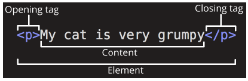
```
<!-- To jest komentarz w języku HTML -->
```
Atrybuty znaczników:
```
<znacznik atr1="war1" atr2="war2">zawartość znacznika</znacznik> <znacznik atr1="war1" atr2="war2" atr3="war3">
<znacznik atr1="war1 wart2 wart3" atr2="war2">zawartość znacznika</znacznik>
```
Znacznik może posiadać wiele wartości atrybutu, które oddziela się spacją:
```
<znacznik atr1="war1 wart2 wart3" atr2="war2">zawartość znacznika</znacznik>
```
Istnieją też atrybuty, które nie posiadają w ogóle wartości
```
<znacznik atr1>zawartość znacznika</znacznik>
```
W praktyce wolno w ten sposób "skracać" atrybuty binarne, które stosują konwencję w postaci, że obecność atrybutu oznacza jego domyślną wartość równą true, a jego brak ustawienie tego atrybutu na false. Możliwe jest też podanie jako wartości atrybutu jego nazwy, albo pustej wartości w celu oznaczenia, że ma on wartość true. **Jednak jawne podstawienie true albo false jest niepoprawne, tj. oficjalnie Living Standard tego zabrania (choć w praktyce spotykane i wspierane przez przeglądarki).**
```
<znacznik atr1="">zawartość znacznika</znacznik> <!-- poprawnie>
<znacznik atr1="atr1">zawartość znacznika</znacznik> <!-- poprawnie>

<znacznik atr1="false">zawartość znacznika</znacznik> <!-- niepoprawnie>
<znacznik atr1="true">zawartość znacznika</znacznik> <!-- niepoprawnie>
```
Wyróżnia się dwie grupy atrybutów: lokalne i globalne.

• Atrybuty globalne to te, których można użyć z dowolnym znacznikiem np. class, id, style
```
<znacznik id="wstep" class="">zawartość znacznika</znacznik>
```

• Atrybuty lokalne to te których można używać z konkretnymi znacznikami np. znacznik img posiada lokalny atrybut alt
```

```

Atrybuty można nieformalnie porównać do pól obiektu.

Wskazówki i porady:

• HTML nie jest case-sensivite, natomiast zaleca się pisanie nazw elementów małymi literami i jest to powszechnie stosowane,

• nie można zapominać o znacznikach zamykających (oprócz tych niewymagających zamknięcia tj. z ang. tag omission),

• w przypadku zasobów znajdujących się w tej samej domenie, lepiej jest używać ścieżek względnych, co wyklucza problemy związane z ich przenoszeniem w przyszłości (w tym na inny serwer),

• niektóre znaczniki posiadają wymagane atrybuty np. znacznik img wymaga atrybutu alt, w którym zawarty jest tekst alternatywny dla użytkownika w razie problemu z wyświetleniem obrazka, lub wspomaga audiodeskrypcję dla osób niewidomych,

• wartości atrybutów znaczników muszą być zawarte w cudzysłowach, gdy w danej wartości występują spacje i inne znaki (" ' ` = < >), ale zaleca się zawsze używać cudzysłowów.

• używanie nagłówków (ang. headers) nie jest istotne tylko w kwestii wyglądu, ale także pod kątem semantyczności,

• w akapitach (ang. paragraph) dodatkowe spacje i znaki nowej linii są pomijane na wyświetlanej stronie,

• umieszczanie dużych obrazów może spowolnić ładowanie strony,

• obecnie UTF-8 jest domyślnym kodowaniem znaków (ang. charset), które zastąpiło wcześniej powszechnie używane ASCII, aczkolwiek jawne zdefiniowanie kodowania znaków może być pomocne dla przestarzałych albo niezgodnych ze specyfikacją klientów (w tym przeglądarek),

• część znaczników wyświetla zawartość od nowej linii (typu block), a pozostała część nie (typu inline).

• **w atrybutach src, href podaje się zasadniczo poprawnie zdefiniowane adresy URL. Przy czym mogą to być: adresy względne (ang. relative) albo bezwzględne (ang. absolute). W pewnym uproszczeniu można przyjąć, że wyjściowo folder, w którym znajduje się otwarty plik HTML jest bieżącym i względem niego następuje definiowanie relatywnych ścieżek (może to jednak być zmienione za pomocą [link](https://html.spec.whatwg.org/multipage/semantics.html#the-base-element). Więcej tutaj: [link](https://url.spec.whatwg.org/#url-writing) , [link](https://url.spec.whatwg.org/#url-miscellaneous)**

### Specyfikacja HTML wyróżnia następujące kategorie elementów:

<br>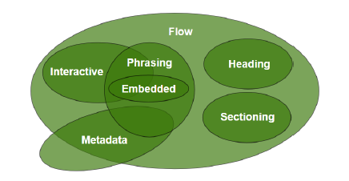

[link](https://html.spec.whatwg.org/multipage/dom.html#kinds-of-content)

## **Zadanie 1.**

Utwórz dokument index.html (zwyczajowa nazwa głównego dokumentu HTML, automatycznie ładowana przez serwer HTTP po wpisaniu adresu URL strony internetowej), a w nim szkielet dokumentu, którego język to język polski, tytuł wygląda w następujący sposób: "Jan Kowalski – muzyka to moja pasja".

Uruchom Visual Studio Code, w którym otwórz projekt (folder) o nazwie LAB002. Dla przejrzystości drzewa projektu zainstaluj dodatek dla VSCode o nazwie Material Icon Theme, który zawiera ikony dla plików i folderów sugerujące ich zawartość.

<br>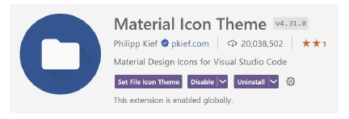

Wpisz w utworzonym pliku index.html ciąg "html:" i zatwierdź klawiszem enter snippet podstawowego dokumentu HTML5.

<br>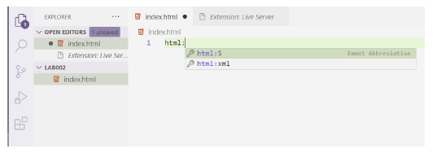

Ustaw tytuł strony w znaczniku <title> na "Jan Kowalski - z pasją do muzyki".

Zainstaluj dodatek "Live Server". Jest to serwer deweloperski (czyli służący do tworzenia stron, a nie hostowania ich na produkcji). Słowo Live oznacza, że po zrobieniu jakiejkolwiek zmiany serwer przeładowuje stronę i ją od razu renderuje.

<br>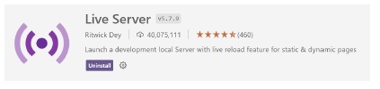

Uruchomić stronę w przeglądarce klikając prawym przyciskiem myszy polu edytora a następnie wybrać opcję Open with Live Server.

<br>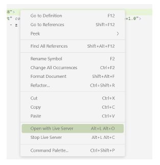

Dodatek odświeży automatycznie stronę po zapisaniu pliku w VSCode

<br>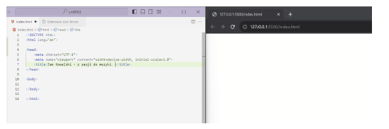

Niezapisany plik oznaczony jest kropką na karcie z nazwą pliku. **Zapisać plik i zapamiętać skrót służący do zapisywania ctrl+s (kropka powinna zniknąć a strona w przeglądarce zostać odświeżona).**

Na marginesie istnieje też możliwość zainstalowania dodatku, który renderuje HTML wewnątrz VSCode'a do szybkiego podglądu.

<br>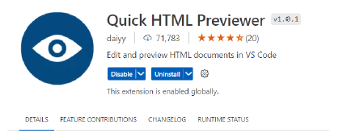

W celu włączenia podglądu wciskamy najpierw ctrl+q a następnie po zwolnieniu tych klawiszy s.

## **Zadanie 2.**

Tag `<h1>` do `<h6>` służy do tworzenia nagłówków dla sekcji dokumentu.

Nagłówek pierwszego stopnia <h1> jest najważniejszy. W przeszłości zalecano wykorzystanie go jedynie jeden raz w całym dokumencie, jednak HTML5 zniósł to ograniczenie. Nagłówki mogą pojawiać się wielokrotnie w dokumencie.

Utwórz nagłówek pierwszego poziomu zawierający tytuł strony związany z zainteresowaniami np. Topo wspinaczkowe – przewodnik dla nowicjuszy

<br>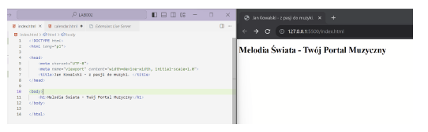

Utwórz nagłówek 2 poziomu o tytule Zespół Redakcyjny. Oraz nagłówek 3 poziomu z imieniem i nazwiskiem.

Tag `` służy do zamieszczania grafiki w dokumencie. Atrybuty `src` oraz `alt` są to atrybuty wymagane!

- src= definiuje ścieżkę do obrazka (preferowana jest ścieżka względna)

-alt= tekst wyświetlany, jeśli obrazek nie może zostać wczytany
```

```
Więcej o tagu ``
[link](https://html.spec.whatwg.org/multipage/embedded-content.html#the-img-element
https://developer.mozilla.org/en-US/docs/Web/HTML/Element/img)

_Uwaga boczna: założono, że w folderze bieżącym (tj. tym w którym znajduje się ten dokument HTML) znajduje się podfolder images, w którym dopiero znajduje się obraz JPEG._

Pod nagłówkiem umieść zdjęcie redaktora w formacie jpg.

<br>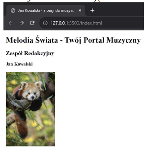

**Umieszczanie zdjęć o bardzo dobrej jakości znacznie obniży wydajność przetwarzania dokumentu HTML przez przeglądarkę.**

Znacznik `<p>` mówi o tym, że dany fragment dokumentu to akapit. Oznacza, to że jego zawartość jest połączona tematycznie i podczas renderingu pojawi się odstęp od innych elementów.

[link](https://developer.mozilla.org/en-US/docs/Web/HTML/Element/p)

[link](https://html.spec.whatwg.org/multipage/grouping-content.html#the-p-element)

```
<p>Treść paragrafu.</p>
```

Użyj tego znacznika do stworzenia opisu redaktora pod zdjęciem. Opis powinien zawierać więcej niż 600 znaków.

<br>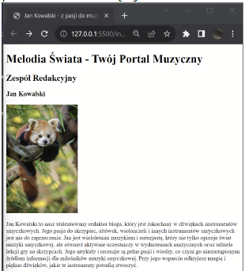

Znacznik <hr> (horizontal breakdown) mówi, że w dalszej części dokumentu wystąpi zmiana tematu.

[link]https://developer.mozilla.org/en-US/docs/Web/HTML/Element/hr?retiredLocale=pl)
[link](https://html.spec.whatwg.org/multipage/grouping-content.html#the-hr-element)

Dodaj nowego redaktora a następnie oddziel treść dotyczącą poszczególnych redaktorów znacznikiem `<hr>`

<br>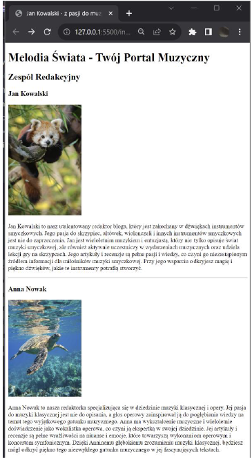

## **Zadanie 3.**

Utwórz nagłówek "Najpopularniejsze artykuły" 2 poziomu.

Utwórz listę nieuporządkowaną trzypoziomową związaną z tematyką strony. 

Przykładowa lista:

<br>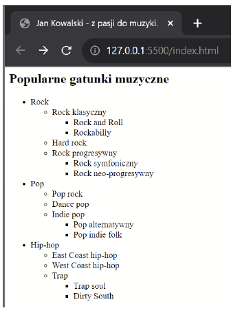

Tworzenie list odbywa się przez zdefiniowanie korzenia znacznikiem `<ol>` (lista uporządkowana ordered list) lub `<ul>` (lista nieuporządkowana, unordered list). Następnie w zawartości znacznika definiujemy elementy listy oznaczone znacznikiem `<li>`.
```
<ol>
  <li>element 1</li>
  <li>element 2</li>
  <li>element 3</li>
  <li>element 4</li>
  <li>element 5</li>
</ol>
```
```
<ul>
  <li>element 1</li>
  <li>element 2</li>
  <li>element 3</li>
  <li>element 4</li>
  <li>element 5</li>
</ul>
```
Aby utworzyć listę zagnieżdżoną należy w elemencie listy zdefiniować nową listę:
```
<ol>
  <li>element 1</li>
  <li>element 2</li>
  <li>element 3
    <ul>
      <li>element 1</li>
      <li>element 2</li>
      <li>element 3</li>
      <li>element 4</li>
      <li>element 5</li>
    </ul>
  </li>
  <li>element 4</li>
  <li>element 5</li>
</ol>
```

[link](https://developer.mozilla.org/en-US/docs/Web/HTML/Element/ol)

[link](https://developer.mozilla.org/en-US/docs/Web/HTML/Element/ul)

[link](https://html.spec.whatwg.org/multipage/grouping-content.html#the-ol-element)

[link](https://html.spec.whatwg.org/multipage/grouping-content.html#the-ul-element)

## **Zadanie 4.**

Utwórz nagłówek **"Terminarz Wydarzeń"** a następnie utwórz tabelę związaną z wydarzeniami tematycznie związanymi z tytułem strony. Przy tworzeniu tabeli należy użyć atrybutów `colspan` (scalanie kolumn) i `rowspan` (scalanie wierszy) do połączenia komórek w odpowiednich miejscach.
Przykładowa tabela:

<br>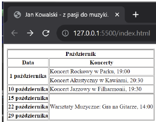

Przykładowa tabela:
```
<table border="1">
  <thead>
    <tr>
      <th>Nagłówek 1 kolumny</th>
      <th>Nagłówek 2 kolumny</th>
      <th>Nagłówek 3 kolumny</th>
    </tr>
  </thead>
  <tbody>
    <tr>
      <th>Nagłówek 1 wiersza</th>
      <td>komórka 1</td>
      <td>komórka 2</td>
    </tr>
    <tr>
      <th>Nagłówek 2 wiersza</th>
      <td>komórka 3</td>
      <td>komórka 4</td>
    </tr>
  </tbody>
</table>
```
• `<table border="1">` główny znacznik, wewnątrz którego definiuje się strukturę tabeli

**Atrybut border jest dodany wyłącznie w celach demonstracyjnych/testowych!!! aby uwidocznić wygląd tabeli. ATRYBUTU NIE NALEŻY STOSOWAĆ WEDŁUG OBECNEJ SPECYFIKACJI HTML!**

• `<thead>` znacznik grupujący nagłówek tabeli

• `<tbody>` znacznik grupujący elementy ciała tabeli

• `<tr>` znacznik definiujący wiersz tabeli, wewnątrz niego zdefiniowane są komórki

• `<th>` znacznik definiujący komórkę nagłówkową

• `<td>` Znacznik definiujący komórkę

Łączenie wierszy i kolumn odbywa się za pomocą atrybutów `rowspan` i `colspan` dodawanych do znaczników komórek.

Łącząc komórki należy podać ich odpowiednią liczbę w danym wymiarze.
```
<table border="1">
  <thead>
    <tr>
      <th>Nagłówek 1 kolumny</th>
      <th colspan="2">połączenie dwóch nagłówków</th>
      <th>Nagłówek 4 kolumny</th>
    </tr>
  </thead>
  <tbody>
    <tr>
      <th>Nagłówek 1 wiersza</th>
      <td>komórka 1</td>
      <td>komórka 2</td>
      <td>komórka 3</td>
    </tr>
    <tr>
      <th>Nagłówek 2 wiersza</th>
      <td>komórka 4</td>
      <td>komórka 5</td>
      <td rowspan="2">połączenie dwóch komórek w kolumnie</td>
    </tr>
    <tr>
      <th>Nagłówek 3 wiersza</th>
      <td>komórka 7</td>
      <td>komórka 8</td>
    </tr>
  </tbody>
</table>
```
[link](https://developer.mozilla.org/en-US/docs/Web/HTML/Element/table)

[link](https://html.spec.whatwg.org/multipage/tables.html#the-table-element)

## **Zadanie 5.**
Znacznik footer (stopka strony) wydziela fragment dokumentu, w którym definiujemy informacje dodatkowe takie jak dane kontaktowe, informacje o prawach autorskich, linki do innych stron, inne informacje.
Wykorzystaj dotychczas zdobyte informacje na temat języka HTML do stworzenia stopki dokumentu zawierającej poprawnie użyte następujące znaczniki:
• `<address>` - wewnątrz znacznika zdefiniowane zostać powinny informacje kontaktowe

• `<a href="">` - służy do tworzenia hiperłączy (linków) w dokumentach. Atrybut href definiuje źródło, do którego odwołuje się zawartość znacznika. W praktyce href powinien być poprawnie zdefiniowanym adresem URL.

• `` osadzone jako zawartość <a> i będące linkami do social media (tj. obraz jest jednocześnie linkiem). Atrybuty width i height pozwalają określić rozmiar obrazka w pixelach.

Wykorzystaj encje do oznaczenia praw autorskich (copyrightów):

[link](https://developer.mozilla.org/en-US/docs/Glossary/Entity)

Przed upowszechnieniem się `UTF-8` encje były konieczne do reprezentowania znaków specjalnych. Obecnie są częściej wykorzystywane, aby wypisać poprawnie znaki <, >, które łatwo pomylić syntaktycznie z początkiem/końcem znaczników.

## **Zadanie 6.**

Zapoznaj się z dokumentacją następujących znaczników:

[link](https://html.spec.whatwg.org/multipage/text-level-semantics.html#usage-summary)

Następnie napisz akapit, który poprawnie wykorzystuje następujące znaczniki:
• `<b>` - reprezentuje fragment tekstu, na który zwraca się uwagę z praktycznych powodów ("bring attention"), bez przekazywania dodatkowego znaczenia i bez sugerowania innej narracji lub nastroju, takich jak słowa kluczowe w streszczeniu dokumentu. W czasach historycznych był to znacznik prezentacyjny "bold font"; wciąż wiele przeglądarek renderuje jego zawartość jako pogrubioną czcionkę, jednak obecnie nie należy polegać na tym zachowaniu. Przykładowo wyszukiwarka potraktuje zawartość tego znacznika jako kluczową dla strony (więc będzie mieć to znaczenie przy pozycjonowaniu strony dla danej frazy), stąd nie powinno się oznaczać tym znacznikiem mniej lub bardziej przypadkowych tekstów.
• `<i>` - reprezentuje fragment tekstu w innej narracji lub nastroju, lub w inny sposób odbiegający od normalnego tekstu np. termin techniczny. W czasach historycznych był to znacznik prezentacyjny "italic", wciąż wiele przeglądarek renderuje jego zawartość jako kursywę, jednak obecnie nie należy polegać na tym zachowaniu.

• `<q>` - reprezentuje cytat (od ang. quotation).

Porównaj wynik renderowania znaczników:

• `<cite>`

• `<em>`

• `<var>`

Co możesz o nim powiedzieć?

## **Zadanie 7.**

Uporządkuj zawartość strony wykorzystując poniższe znaczniki:

• `<hgroup>` - jest używany do grupowania nagłówków <h1>-<h6>, które tworzą hierarchię sekcji na stronie

• `<header>` - jest używany do zawarcia informacji lub elementów, które są zazwyczaj umieszczone na górze strony i dostarczają ogólnych informacji o treści strony lub sekcji

• `<article>` - ma znaczenie semantyczne związane z sekcją lub treścią, która stanowi niezależną i samodzielnie sensowną część strony internetowej lub dokumentu.

• `<section>` - treści, które są ze sobą powiązane tematycznie lub konceptualnie

• `<aside>` - informacje dodatkowe, które mogą być interesujące, ale nie są niezbędne do zrozumienia treści głównej

• `<nav>` - oznaczaniem sekcji nawigacyjnej strony internetowej

• `<menu>` - znacznik tworzący menu, jest używany zamiast znacznika <ul> - aby semantycznie wskazać, że opcje wewnątrz niego zdefiniowane za pomocą <li> tworzą menu.

**Do każdego z nagłówków drugiego poziomu dodaj atrybut id o unikatowej wartości. Następnie utwórz menu składające się z hiperłączy do odpowiednich nagłówków.**

Hiperłącza mogą odwoływać się do nagłówków przez zdefiniowanie wartości atrybutu href jako **#[id znacznika]**:
```
<a href="#heading">Przejdź do nagłówka o id heading.</a>
<div style="display: block;height: 5000px;"></div>
<h2 id=heading>Nagłówek o id heading</h2>
```

## **Zadanie 8.[*]**

Utwórz dokument będący pierwszym wpisem na blogu. Wykorzystaj zdobytą wiedzę do stworzenia treści wpisu, dodania zdjęć oraz ciekawostki. Ciekawostka powinna być zdefiniowana z użyciem znaczników `<details>` oraz `<summary>`.

[link](https://developer.mozilla.org/en-US/docs/Web/HTML/Element/details)

[link](https://html.spec.whatwg.org/multipage/interactive-elements.html#the-details-element)

`<mark>`

  `<cite>`

    `<ruby>`
