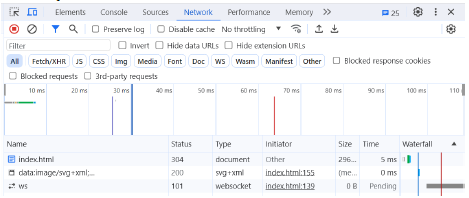
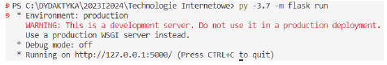
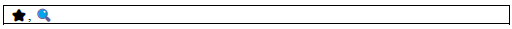
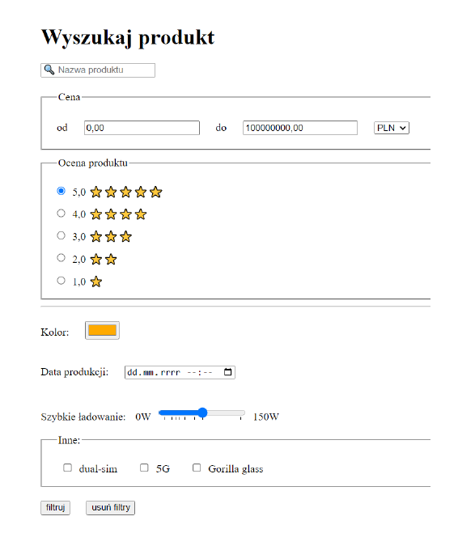

# Formularze

W trakcie rozwoju języka HTML dodano możliwość wykorzystania interakcji użytkownika ze stroną internetową. W tym celu powstały formularze. Nazwa ta nie jest przypadkowa: elementy, jakie wykorzystujemy do ich tworzenia przypominają takie występujące w papierowych formularzach.

### Przykładowy prosty formularz:
```html
<!DOCTYPE html>
<html lang="pl">
<head>
  <meta charset="UTF-8">
  <title>Title</title>
</head>
<body>
  <form>
  <h1>Formularz kontaktowy</h1>
  <label for="name">Podaj swoje imię i nazwisko: </label>
  <input id="name"> <br>
  <label for="mail">Podaj adres email: </label>
  <input type="email" id="mail" name="email"><br>
  <label for="content">Podaj treść wiadomości</label>
  <textarea id="content" name="content"></textarea>
  <br>
  <button>Wyślij</button>
  </form>
</body>
</html>
```
Formularz oznaczamy znacznikiem `<form>`. Na stronie może znajdować się wiele formularzy jednocześnie, które działają niezależnie. Element `button` jako element potomny `form` domyślnie służy do przesłania danych z formularza na serwer. Historycznie jedynym sposobem na przetworzenie danych w formularzu było podanie w atrybucie `action` URLa, który zawierał odniesienie do serwera, który obsługiwał to żądanie. Zasadniczo drugą możliwością pracy z formularzami jest ich przetwarzanie po stronie klienta za pomocą języka `JavaScript`. Wtedy zwykle nie ma potrzeby korzystania z atrybutu action. Element `label` oznacza po prostu etykietę danego elementu formularza, jednak stosując dodatkowo atrybut for możemy określić dokładnie którego (podając jego id). Przeglądarki wykorzystują tę informację w różnych sytuacjach (np. dotykając/klikając label przejdziemy do edycji elementu nim oznaczonego; czytniki głosowe stron internetowych mają dzięki temu ułatwioną pracę). **Można również pominąć for, jeżeli input jest elementem potomnym `label`.**

W poniższym przykładzie element input posiada atrybuty `name`, który z jednej strony nazywa dane pole formularza, z drugiej może być uważany za niezbędny, gdyż elementy bez tego atrybutu nie zostaną przesłane na serwer. Atrybut type pozwala określić jaki rodzaj wejścia ma przyjmować element `input`; w tym przypadku ustawiono `number`, zatem niemożliwe będzie wpisanie znaków innych niż numeryczne (uwzględniając separatory dziesiętne, jak i znak -, +). Ponadto ustalono atrybut min ustawiający minimalną wartość pola. Element output nigdy nie jest wysyłany na serwer, jego rolą jest jedynie prezentowanie jakiejś już przetworzonej wartości. Atrybut `value` pozwala ustawić początkową wartość elementu (bez jego użycia widzimy elementy jako puste, nieuzupełnione); w przypadku wystąpienia razem z `type="radio"` albo `type="checbox"` i `type="hidden"` atrybut ten można uznawać za obowiązkowy, gdyż ta wartość zostanie wysłana na serwer.

  *Z uwagi na fakt, że na tym etapie laboratorium nie wystąpił jeszcze język JavaScript, poniższy formularz nie będzie przeliczał w praktyce długości w cm na cale. Pokazano jednak jak zdefiniować tego typu formularz w HTML.*
```html
  <form>
<label>Podaj długość w cm: </label>
<input name="length" type="number" min="0" value="1" id="length"><br>
<label>Dlugość w calach: </label><output for="length">2,54</output>
<button>do something</button>
</form>
```
Ważniejsze atrybuty input:

- autofocus – pozwala nam wybrać które pole formularza powinno być aktywne po załadowaniu strony. Tylko jeden element formularza może posiadać ten atrybut.

- placeholder - podpowiedź jaka treść powinna zostać wpisana w dane pole formularza, znika kiedy zaczynamy edytować dany element.

- autocomplete – informacja dla przeglądarki, aby spróbować uzupełnić automatycznie dane pole, dotyczy to takich informacji jak adres, nr telefonu, email itd.

- required – uzupełnienie wartości w formularzu jest obligatoryjne

- disabled – brak możliwości interakcji z elementem, jednak może on mieć wartość ustawioną domyślnie

- name – definiuje klucz pod jakim będzie przesyłana wartość pola formularza. **Definiując wartości tego atrybutu nie zaleca się wykorzystywania polskich znaków!**

Dowolne oprogramowanie, które parsuje i renderuje HTML (używa się tutaj określenia ang. user agent, co oznacza klasę szerszą niż tylko przeglądarki), nie są zobligowane do prezentowania dokumentów HTML w określony sposób (warstwa prezentacji została przeniesiona do kompetencji CSS).

**Dokumentacja HTML Living Standard [link](https://html.spec.whatwg.org/) dostarcza zestawu sugestii dotyczących renderowania dokumentów HTML, których przestrzeganie jest prawdopodobnie zgodne z intencjami deweloperów.**

Dotyczy to dużej liczby elementów formularzy jednak nie używa się słowa "musi" w kontekście wyświetlania danych znaczników. Zamiast tego, używa się terminu "expected" (oczekiwane), aby wskazać zachowanie, które doprowadzi do osiągnięcia zamierzonego efektu. Sugestie zawarte w dokumentacji zakładają ogólnie, że medium wyjściowe ma rozdzielczość co najmniej 96 ppi. Sugestie dotyczące prezentacji są głównie wyrażane w terminach CSS i oczekuje się, że programy przeglądające będą obsługiwać CSS lub dostosują te sugestie do innych mechanizmów prezentacji. **Jednakże nie można zignorować faktu, że w przeszłości elementy formularzy były renderowane w konkretny sposób bez CSS** i poniekąd **dla kompatybilności wstecz** utrzymano, że elementy formularzy nieostylowane w żaden sposób, wyświetlają się w sposób **„domyślny”, choć zależny od konkretnej przeglądarki.**

## [Zadanie 1.](https://techint.dawidolko.pl/LAB3/TASK1/kontakt.html)
Utwórz dokument kontakt.html w którym, utworzysz formularz zawierający imię i nazwisko, numer telefonu, adres email (wykorzystaj odpowiedni atrybut type), treść wiadomości (wykorzystaj element textarea i atrybuty rows and cols). Pamiętaj o poprawnym zdefiniowaniu elementów label i ustawieniu atrybutów for a także placeholder.

[link](https://developer.mozilla.org/en-US/docs/Web/HTML/Element/textarea)

## [Zadanie 2.](https://techint.dawidolko.pl/LAB3/TASK2/kontakt.html)

Do znacznika `<form>` z poprzedniego zadania dopisz atrybut `action` o wartości "" i dopisz atrybut `method=”get”` (jest to domyślna wartość, ale warto poznać ten atrybut). Ustawienie `action=””` spowoduje że formularz będzie wysyłany przez **dokument do samego siebie**, tutaj stosujemy to dlatego że **nie napisano serwera**, który obsługiwałby ten formularz, ale może też być wykorzystywany, aby formularz nie posiadał efektów ubocznych (ang. side effects). Zwykle podaje się tutaj adres URL serwera (względny albo bezwzględny), który będzie przetwarzał dane z formularza.

Przeczytaj dokumentację elementu button:

[link](https://developer.mozilla.org/en-US/docs/Web/HTML/Element/button)
Następnie dodaj do formularza dwa przyciski:
- typu submit, którego prawdziwą rolą byłoby wykonanie przesłania danych formularza do klasycznego serwera np. zaprogramowanego w PHP, Python, Java, itd.

- typu reset, którego rolą jest zresetowanie elementów formularza do stanu początkowego m.in. "wyczyszczenie" pól tekstowych, zresetowanie zaznaczeń pól wyboru; **obecnie nie poleca się stosowania tego przycisku,
zwłaszcza gdyby mógł zostać pomylony z wyślij.**

### 1.
Przetestuj działanie obu przycisków. Wyjaśnij co dzieje się po kliknięciu pierwszego (obserwuj też adres URL w przeglądarce).
### 2.
Zmień wartość atrybutu method na post i ponownie naciśnij 1. przycisk. Wyjaśnij jakie jest tym razem zachowanie formularza.
### 3.
Naciśnij przycisk F12 (na laptopie Fn + F12) i włącz następującą zakładkę:

<br>

### 4.
Następnie ponownie prześlij formularz, zarówno z method=”get” i method=”post”. Obserwuj wygenerowane żądania HTTP i opisz czym się różnią (na podstawie zakładek headers i payload). Metoda post nie zostanie poprawnie obsłużona (gdyż serwer nie oczekuje na przesłanie tego formularza pod danym adresem URL) i otrzymamy
komunikat o błędzie, jednak pomimo tego można zaobserwować jak
zostanie wysłane żądanie HTTP.
### 5.* Żeby lepiej zrozumieć działanie metody post utwórz następujący plik w języku programowania Python (interpreter tego języka musi być również zainstalowany) i zapisz go jako app.py:

```python
from flask import Flask, request

app = Flask(__name__)

@app.route("/", methods=['POST'])
def hello_world():
  return "I received email:" + request.form['email'] + ' and
content: ' + request.form['content']
```
Uruchom w terminalu komendy:

`pip install flask`

`flask run`
Albo
`python -m flask run`

Wyjście w terminalu powinno wyglądać mniej więcej tak:

<br>

**Jednocześnie ustaw wartość atrybutu action na http://localhost:5000/ i nazwy odpowiednich elementów formularza na email i content.**

Znajomość języka Python nie jest tutaj najważniejsza, bardziej istotne jest, że posiadamy teraz aktywny serwer, który może obsłużyć formularz. Język Python został też wybrany z powodu zwięzłości kodu i łatwości uruchomienia serwera.

Jaki jest teraz efekt działania formularza?

## [Zadanie 3.](https://techint.dawidolko.pl/LAB3/TASK3/kontakt.html)

[link](https://developer.mozilla.org/en-US/docs/Web/HTML/Element/select)

Znacznik `<select>` reprezentuje interaktywny element zawierający wiele opcji do wyboru zdefiniowanych przy użyciu `<option>`. **Ważne by zdefiniować atrybut name dla znacznika `<select>` który będzie odpowiedzialny za 
wartości wysłane przez ten element formularza.** *W znaczniku `<option>` ważne jest zdefiniowanie atrybutu value który zostanie użyty jako wartość przesyłana przez formularz.* Wartości name i value utworzą parę klucz 
wartość przesyłaną jako wybór w formularzu.

Elementy zawarte w liście wyboru można pogrupować używając znacznika `<optgroup>` w którym atrybut label będzie etykietą dla danej grupy opcji wyboru.

Wielokrotny wybór dla danej listy można ustawić za pomocą atrybutu multiple po którym należy użyć atrybutu size przyjmujący wartość liczbową będącą liczbą opcji do wybrania. *_Wiele opcji w większości przeglądarek można wybrać przytrzymując klawisz ctrl i klikając na opcje, które chcemy wybrać._*
```html
<label for="contact-topic">Typ zapytania</label>
<select id="contact-topic" name="contact-topic" multiple size="2">
<optgroup label="Pytania ogólne">
<option value="ofer1">Oferta produktów</option>
<option value="kontakt1">Kontakt z działem obsługi klienta</option>
</optgroup>
<optgroup label="Zapytania techniczne">
<option value="problem1">Problem techniczny z witryną</option>
<option disabled value="uzytkownik1">Zgłoszenie użytkownika</option>
</optgroup>
</select>
```
Rozbuduj formularz o listę rozwijaną, z której możliwy będzie wybór 20 miast w Polsce. Pogrupuj miasta według województw. Możliwe jest do wyboru tylko jedno miasto. **Dwa ostatnie miasta z listy powinny nie być możliwe do wyboru.**

## [Zadanie 4.](https://github.com/dawidolko/Internet-Technologies/tree/main/LAB3/TASK4)
Znacznik `<input>` którego atrybut type zdefiniujemy na checkbox może mieć dwa podstawowe stany: zaznaczony i niezaznaczony. **Istnieje trzeci stan "indeterminate" który jest używany do kontrolowania grupy checkboxów. Stan ten oznacza, że co najmniej jedna ale nie wszystkie dostępne opcje zostały wybrane i można go ustawić jedynie za pomocą JavaScriptu.**

W kontekście checkboxów ważna jest definicja następujących atrybutów:

- checked – obecność tego atrybutu sprawi, że będzie on domyślnie zaznaczony
- 
- value - wartość, która zostanie przesłana do serwera, jeżeli checkbox będzie zaznaczony, po przesłaniu formularza

Checkboxy powinny być stosowane w sytuacji, w której chcemy umożliwić wybór kilku opcji jednocześnie (np. podczas filtrowania wyników wskazujemy konkretne marki, jakie nas interesują). Co do zasady dopuszcza się, że żaden z checkboxów w formularzu nie będzie zaznaczony.
```html
<label>
  <input type="checkbox" name="wybor1" value="opcja1"> Opcja 1
</label><br>
<label>
  <input type="checkbox" name="wybor2" value="opcja2"> Opcja 2
</label><br>
<label>
  <input type="checkbox" name="wybor3" value="opcja3"> Opcja 3
</label><br>
<label>
  <input type="checkbox" name="wybor4" value="opcja4"> Opcja 4
</label><br>
<label>
  <input type="checkbox" name="wybor5" value="opcja5"> Opcja 5
</label>
```
Utwórz w formularzu następujące pola wyboru:

- Akceptuję regulamin serwisu
  
 - Pole powinno być domyślnie zaznaczone bez możliwości jego odznaczenia. Pole jest wymagane.

- Subskrybuj newsletter
  
## [Zadanie 5.](https://techint.dawidolko.pl/LAB3/TASK5/kontakt.html)
[link](https://developer.mozilla.org/en-US/docs/Web/HTML/Element/input/radio)

Kolejny typ znacznika `<input>` to radio. Pozwala on na stworzenie grupy pól wyboru z których możliwe jest zaznaczenie tylko jednej opcji. Te same wartości atrybutu `name` tworzą grupę z której możliwe jest wybranie tylko jednej opcji i zmiana zaznaczenia jednego z tych elementów automatycznie odznacza poprzednio zaznaczony. **Ważne jest dodanie atrybutu value którego wartość będzie przesyłana do serwera.** Technicznie możliwe jest że formularz będzie tak utworzony, że możliwe będzie niezaznaczenie żadnej z opcji.
```html
<label>
  <input type="radio" name="wybor" value="opcja1"> Opcja 1
</label><br>
<label>
  <input type="radio" name="wybor" value="opcja2"> Opcja 2
</label><br>
<label>
  <input type="radio" name="wybor" value="opcja3"> Opcja 3
</label><br>
<label>
  <input type="radio" name="wybor" value="opcja4"> Opcja 4
</label><br>
<label>
  <input type="radio" name="wybor" value="opcja5"> Opcja 5
</label>
```
Utwórz w formularzu grupę przycisków która będzie odpowiedzialna za wybranie jednej spośród następujących opcji:

- Zgłoszenie problemu technicznego
  
- Propozycja współpracy
  
- Pytania dotyczące treści
  
- Zgłoszenie nadużycia
  
## [Zadanie 6.](https://techint.dawidolko.pl/LAB3/TASK6/kontakt.html)
Znacznik `<fieldset>` służy do grupowania kilku elementów formularza w grupy tematyczne. Znacznik `<legend>` wewnątrz znacznika `<fieldset>` definiuje opis danej grupy elementów interaktywnych. Zwykle przeglądarki automatycznie obramowują ten element, choć jego wygląd należy definiować za pomocą CSS.

[link](https://developer.mozilla.org/en-US/docs/Web/HTML/Element/fieldset)

Pogrupuj elementy formularza według kategorii:

- Zgody na przetwarzanie danych
  
- Powód zgłoszenia
  
- Informacje o użytkowniku
  
## [Zadanie 7.](https://techint.dawidolko.pl/LAB3/TASK7/kontakt.html)
Zapoznaj się z pozostałymi typami input:

[link](https://developer.mozilla.org/en-US/docs/Web/HTML/Element/input#input_types)

Następnie w bieżącym dokumencie utwórz sekcję umożliwiającą stworzenie konta w serwisie. W tej sekcji umieść formularz, w którym wykorzystasz poznane wcześniej znaczniki a ponadto:
1. date (data urodzenia)
   
2. file (obraz - avatar)
   
3. password (hasło konta)
   
4. color (preferowany kolor motywu)
   
Następnie utwórz sekcję, w której możliwe będzie zakupienie biletu na pociąg. W formularzu wykorzystaj:
1. date (data odjazdu)
   
2. time (godzina odjazdu)
   
3. search (wyszukiwanie miasta)
   
4. range (liczba biletów od 1 do maksymalnie 10)

## [Zadanie 8.](https://techint.dawidolko.pl/LAB3/TASK8/kontakt.html)
W celu ograniczenia możliwości przesłania na serwer błędnych danych, stosuje się walidację (sprawdzenie poprawności uzupełnienia) formularza. **Może być ona (i powinna być) wykonywana i po stronie klienta i po stronie serwera.**
Niektóre elementy formularza automatycznie dodają reguły walidacji (np. typ email konieczność obecności znaku @). Wymagania dotyczące walidacji dodajemy za pomocą atrybutów. Najbardziej złożone, ale też i ogólne wymagania dotyczące danego pola można uzyskać za pomocą atrybutu pattern.
[link](https://developer.mozilla.org/en-US/docs/Web/HTML/Attributes/pattern )
Korzystając z dokumentacji dostępnej na [link](https://developer.mozilla.org/en-US/docs/Web/HTML/Element/input) (również z zakładek validation dla danego typu input) ustal następujące wymagania:

-W pole imię i nazwisko możliwe było wpisanie imienia i nazwiska bez możliwości wpisania cyfr a także znaków specjalnych. Muszą być wpisane co najmniej 4 znaki.

-W pole numer telefonu jest wymagane i przyjmuje tylko numery telefonów w postaci +XX XXX XXX XXX gdzie X to cyfry od 0 do 9.

-Treść wiadomości musi mieć co najmniej 20 znaków.

-Można załączyć jedynie pliki pdf.

-Nie można wybrać daty niższej niż dzisiejsza i późniejszej niż 3 miesiące do przodu (stosowane np. do zakupu biletów w komunikacji publicznej)

-Liczba sztuk musi być większa od 0 i jednocześnie nie może być ułamkiem dziesiętnym

Przetestuj działanie zdefiniowanych reguł walidacyjnych. Przy próbie wysłania formularza wciskając przycisk z atrybutem type=submit w przeglądarce powinny pokazać się dymki z opisanym powodem błędu walidacji.

Sprawdź czy po poprawnym przesłaniu w adresie URL znajdują się wszystkie wartości wybrane wcześniej w formularzu i czy ich nazwy są zdefiniowane w sposób umożliwiający czego dotyczy dana wartość.

## [Zadanie 9.](https://techint.dawidolko.pl/LAB3/TASK9/)
Odwzoruj formularz zaprezentowany poniżej. Pamiętaj o ustawieniu wszystkich potrzebnych atrybutów: `id`, `for`, `value`, `name`.

Wykorzystaj następujące symbole graficzne (mogą się renderować różnie w zależności od czcionki, czy miejsca gdzie je wyświetlamy, ale to znaki UTF):

<br>
<br>

W przeglądarce Google Chrome zainstaluj rozszerzenie: [link](https://chrome.google.com/webstore/detail/screen-reader/kgejglhpjiefppelpmljglcjbhoiplfn?utm_source=ext_sidebar&hl=pl)
I upewnij się, że jest aktywne:

Klikaj następnie w utworzone elementy. Jakie powstały korzyści z ustawiania atrybutów i etykiet? Porównaj działanie czytnika ekranu na formularzu, w którym nie ma etykiet, ani atrybutów value w checkboxach, radiobuttonach albo option.
