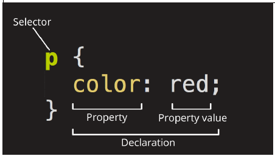
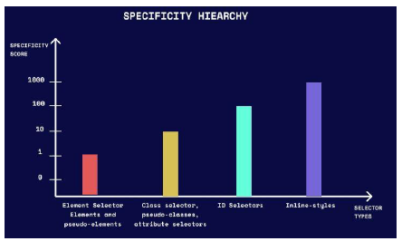
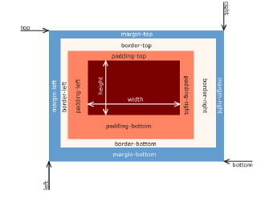
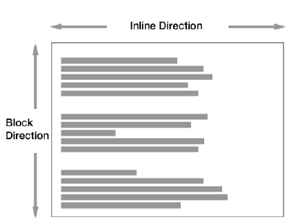
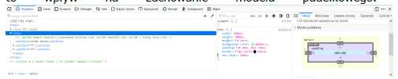
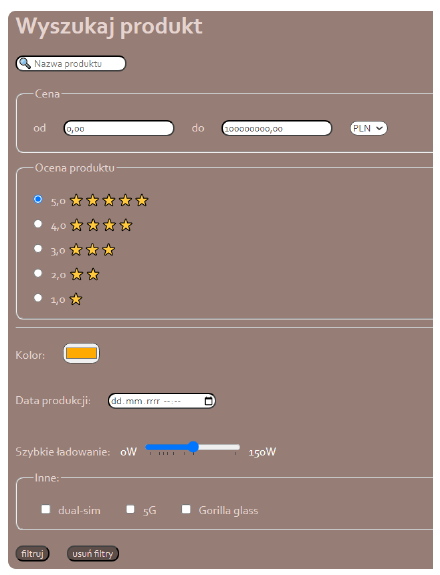
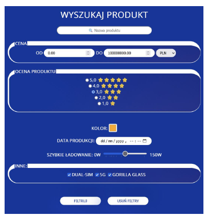
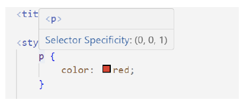

# Podstawy CSS3

## Idea oddzielenia warstwy prezentacji (tj. wyglądu na urządzeniu końcowym) 
## dokumentu od jego struktury została po raz pierwszy wykorzystana w języku znaczników.

Scribe: [link](https://en.wikipedia.org/wiki/Scribe_markup_language). 

W momencie powstania języka HTML istniały już języki arkuszy styli stosowane do stylowania 
SGMLa (DSSSL i FOSI), jednak z różnych powodów (głównie poziomu skomplikowania) uznano je za nieadekwatne do stylowania dokumentów HTML. 

Początkowo zaproponowano kilka rywalizujących języków styli, z których stopniowo przewagę zdobył CSS, choć problemem było niepełne wsparcie przeglądarek. 
Zdarzały się też sytuacje, że twórcy przeglądarki dodawali własne pomysły i wybory implementacyjne, w ogóle nie występujące w standardach, co tylko pogłębiało 
chaos i opóźniało upowszechnienie się standardu. Równolegle stosowano też znaczniki prezentacyjne, które również przeszkadzały w adaptacji CSS. CSS do wersji 
2.0 był jednolitą specyfikacją. W trakcie wprowadzenia CSS w wersji 3 doszło do modularyzacji zagadnień w standardzie (tj. poszczególne moduły rozwijają się 
iezależnie i mają własne wersje). Obecnie nie jest planowane wydanie CSS4 jako jednolitej wersji, ale raczej wydawanie nowych wersji modułów. Więcej na ten 
temat można przeczytać tutaj: 

[link](https://www.w3.org/TR/css-2023)

CSS jest językiem formalnym (tzn. posiada ściśle zdefiniowaną gramatykę), ale nie jest językiem programowania (nie jest w stanie wykonać dowolnego algorytmu). Zasadniczo CSS składa się **z reguł stylowania (ang. style rules)**. Większość reguł stylowania składa się z selektora, po którym występuje **blok deklaracji** oddzielonych średnikiem. **Deklaracja** to para właściwość-wartość. Co do zasady standard CSS definiuje zamknięty zestaw właściwości i dostępnych dla nich wartości, aczkolwiek istnieją obecnie rozwiązania, które pozwalają **rozszerzać CSS o własne właściwości.**

**Spis wszystkich dostępnych właściwości znajduje się tutaj:**
[link](https://developer.mozilla.org/en-US/docs/Web/CSS/Reference#index)
Plik z rozszerzeniem *.css z wyrażeniami napisanymi w tym języku nazywamy arkuszem stylu (ang. stylesheet).

[link](https://pl.wikipedia.org/wiki/Kaskadowe_arkusze_styl%C3%B3w)

[link](https://developer.mozilla.org/en-US/docs/Learn/Getting_started_with_the_web/CSS_basics)

```html
selektor {
  właściwość: wartość /* deklaracja */
}
selektor {w
  właściwość1: wartość1; /* deklaracja 1 */
  właściwość2: wartość2; /* deklaracja 2 */
}
selektor1, selektor2 {
  właściwość1: wartość1;
  właściwość2: wartość2;
}
```

<br>

Selektor w języku CSS może przyjąć różne formy. Może to być nazwa znacznika (elementu HTML), co oznacza, że wszystkie wystąpienia tego elementu HTML zostaną sformatowane zgodnie z ustalonymi regułami stylizacji. Inną formą selektora jest arbitralna nazwa, nazywana w tym kontekście selektorem klasy CSS. Identyfikator (id) może również pełnić rolę selektora CSS. **Istnieje także specjalny selektor '*', który obejmuje wszystkie elementy HTML na stronie.** Dodatkowo, selektor może zawierać atrybut, co pozwala na wybieranie elementów z określoną wartością atrybutu. W ten sposób, przy pomocy różnorodnych selektorów, możliwe jest precyzyjne określenie, które elementy na stronie internetowej zostaną sformatowane przy użyciu reguł stylizacji CSS.

Jednoznacznie można stwierdzić czy dany selektor to selektor znacznika, klasy itd. na podstawie gramatyki języka CSS (tj. każdy typ selektora tworzy inne wyrażenie w tym języku). Wyróżniamy następujące selektory:
- **Selektor znacznika** (oznaczono kolorem żółtym) to nazwa znacznika np.:
- 
```html
<!DOCTYPE html>
<html lang="pl">
<head>
  <meta charset="UTF-8">
  <meta name="viewport" content="width=device-width, initial-scale=1.0">
  <title>Selektory znacznika</title>
<style>
  /* Kolor tekstu paragrafu będzie miał kolor czerwony */
  p {
    color: crimson;
  }
  /* Kolor tekstu nagłówka 1 będzie miał kolor czarny */
  h1 {
    color: black;
  }
  /* w sekcji preformatowanej tekst będzie pomarańczowy */
  pre {
    color: #ffaa00
  }
</style>
</head>
<body>
  <h1>Nagłówek</h1>
  <p>Paragraf</p>
  <pre>Sekcja preformatowana</pre>
</body>
</html>
```
- **Selektor klasy** – selektor klasy jest oznaczony prefiksem `'.'` przed nazwą klasy, której dotyczy. Przy definiowaniu nazw klasy należy:

o Unikać słów kluczowych i nazw znaczników html np.: `.div` lub `.span` są niezalecanymi nazwami.

o Nazwa klasy powinna być krótka i opisowa np. `.header` `.btn-light.`

o Nazwa nie powinna zawierać polskich znaków.

o Nazwy wieloczłonowe należy zapisywać stosując camelCase lub oddzielać poszczególne człony znakiem `'-'` np. `.btn-pressed` `.btnPressed.`

o Przyjmując pewną konwencję należy stosować ją sumiennie w całym dokumencie/dokumentach tworzących witrynę.

o Ta sama klasa może być stosowana do dowolnego elementu HTML.

```html
<!DOCTYPE html>
<html lang="pl">
<head>
  <meta charset="UTF-8">
  <meta name="viewport" content="width=device-width, initial-scale=1.0">
<title>Selektory znacznika</title>
<style>
  /* Kolor tekstu będzie miał kolor czerwony */
.klasa1 {
    color: crimson;
}
  /* wyświetlany tekst będzie bardzo mały */
  .klasa2 {
    font-size: xx-small;
}
</style>
</head>
<body>
  <p class="klasa1">Paragraf 1</p>
  <p class="klasa2">Paragraf 2</p>
  <!-- Do paragrafu 3 zastosowano dwie klasy. Tekst będzie czerwony i mały. -->
  <p class="klasa1 klasa2">Paragraf 3</p>
</body>
</html>
```

- **Selektor identyfikatora** – jest oznaczony prefiksem '#' przed nazwą identyfikatora (id).
```
<!DOCTYPE html>
<html lang="pl">
<head>
  <meta charset="UTF-8">
  <meta name="viewport" content="width=device-width, initial-scale=1.0">
  <title>Selektory znacznika</title>
<style>
  /* Kolor tekstu będzie miał kolor czerwony */
  #paragraph1 {
    color: crimson;
}
  /* wyświetlany tekst będzie bardzo mały */
  #paragraph2 {
    font-size: xx-small;
}
</style>
</head>
```
```
<body>
  <p id="paragraph1">Paragraf 1</p>
  <p id="paragraph2">Paragraf 2</p>
</body>
</html>
```
- **Selektor atrybutu** – do nazwy elementu dodajemy wyrażenie, gdzie pomiędzy znaki "[]" należy zdefiniować atrybut lub parę atrybut wartość, które powinien posiadać dany znacznik lub element z danym id lub klasą.
```
<!DOCTYPE html>
<html lang="pl">
<head>
  <meta charset="UTF-8">
  <meta name="viewport" content="width=device-width, initial-scale=1.0">
  <title>Selektory znacznika</title>
<style>
  input[type="text"] {
    border: 1px solid #ccc;
    padding: 5px;
  }
</style>
</head>
  <body>
  <input type="text" placeholder="Wpisz coś" /> <!-- Ten input zostanie stylizowany ze względu na typ "text" -->
  <input type="password" placeholder="Hasło" /> <!-- Ten input nie zostanie stylizowany, ponieważ nie ma typu "text" -->
  </body>
</html>
```
- **Selektor pseudoklasy** – oznaczony jest prefiksem ':'. Selektory pseudoklasy pozwalają tworzyć dynamiczne i interaktywne efekty na stronie internetowej. Selektory te definiują jego zachowanie w danym stanie (np. po najechaniu myszką, po naciśnięciu myszką itd.) a niekoniecznie odnoszą się do jego pozycji w dokumencie.
```
<!DOCTYPE html>
<html lang="pl">
<head>
<meta charset="UTF-8">
<meta name="viewport" content="width=device-width, initial-scale=1.0">
<title>Selektory znacznika</title>
<style>
  a:hover {
    color: red;
}
</style>
</head>
<body>
  <a href="https://www.example.com">Najedź kursorem, aby zmienić kolor linku</a>
</body>
</html>
```
- **Selektor pseudoelementu** - Pseudoelementy pozwalają na dodawanie zawartości lub stylizację konkretnych części elementów, takich jak pierwszy znak tekstu, pierwszy wiersz tekstu, czy zawartość przed lub za elementem. Zazwyczaj elementy te fizycznie nie istnieją w dokumencie (tzn. są częścią innego elementu, której nie wyodrębnia się jako znacznik HTML), aby możliwe było zastosowanie styli w inny sposób. Selektor powstaje przez dodanie do nazwy elementu przyrostka :: z nazwą selektora pseudoelementu.
```
<!DOCTYPE html>
<html lang="pl">
<head>
  <meta charset="UTF-8">
  <meta name="viewport" content="width=device-width, initial-scale=1.0">
  <title>Selektory znacznika</title>
<style>
  p::before {
    content: "Przed paragrafem: ";
    font-weight: bold;
    color: blue;
}
</style>
</head>
<body>
  <p>To jest zwykły paragraf.</p>
</body>
</html>
```
- itd. https://developer.mozilla.org/en-US/docs/Web/CSS/CSS_selectors

### Stosowanie styli CSS:
• **inline**, deklarowany za pomocą atrybutu style, niezależnie dla danego znacznika. Stosowanie tej metody jako jedynej to zła praktyka! Należy co do zasady stosować arkusze CSS, a inline stosować jedynie w sytuacji, gdy chcemy pojedyncze elementy ostylować w nietypowy sposób, zwłaszcza gdyby odpowiedni selektor w arkuszu był bardzo skomplikowany. Style inline nie posiadają selektorów. Oczywistą wadą tych styli jest to, że są "jednorazowego użytku", to jest musielibyśmy każdemu elementowi definiować je z osobna, co jest marnotrawstwem i utrudnia zarządzanie większymi dokumentami HTML:
```
<znacznik style="color:lightblue;">zawartość znacznika</znacznik>
<znacznik> ta zawartość nie będzie ostylowana </znacznik>
```

• **internal**, powinien być koniecznie zadeklarowany w elemencie head wewnątrz znacznika style. W czasach bliższych początkom rozwoju WWW, gdy strony były relatywnie proste (popularne kiedyś strony osobiste), niejednokrotnie wystarczało zdefiniowanie zwięzłych reguł wewnątrz dokumentu HTML. Obecnie ta technika jest już dość rzadko spotykana, gdyż złożoność stron i aplikacji internetowych jest z reguły za duża, aby to rozwiązanie było nadal użyteczne:
```
<head>
  <meta charset="UTF-8">
  <title>Title</title>
  <style>
    selektor {
      właściwość: wartość
    }
  </style>
</head>
```
• **external**, jest to dołączenie arkusza zewnętrznego, tj. zdefiniowanego w zewnętrznym pliku z rozszerzeniem *.css. Plik ten może znajdować się lokalnie na danym serwerze i wtedy stosujemy ścieżkę względną, jak i może znajdować się na zewnętrznym serwerze i stosujemy wtedy ścieżkę bezwzględną. Obecnie jest to podstawowy sposób korzystania z CSS. Arkusze zewnętrzne załączamy w elemencie head, za pomocą elementu link.:
```
<head>
  <meta charset="UTF-8">
  <title>Title</title>
  <link rel="stylesheet" href="styles.css">
  <link rel="stylesheet" href="https://www.strona.pl/styles.css">
</head>
```
Selektory możemy łączyć. Dostępne jest kilka kombinatorów (ang. combinators), za pomocą których można zdefiniować jakich elementów mają dotyczyć wybrane style.

| Kombinator                          | Składnia | Opis                                                                                                           |
|-------------------------------------|----------|----------------------------------------------------------------------------------------------------------------|
| Kombinator potomka                  | A B      | Element B jest potomkiem A. Nie wiadomo na jakim poziomie. Element B musi znajdować się wewnątrz elementu A.   |
| Kombinator dziecka                 | A > B    | Element B jest dzieckiem A. Znacznik B musi znajdować się bezpośrednio w znaczniku odwołującym się do A.       |
| Kombinator brata następującego     | A + B    | Element B występuje jako pierwszy po A na tym samym poziomie (tj. mają wspólnego rodzica).                     |
| Kombinator następnika bratowego     | A ~ B    | Kombinator (np. h2 ~ p) wybiera wszystkie elementy P, które występują po elementach h2, niezależnie od ich ilości.|
| Kombinator grupy                    | A , B    | Kombinator, (np. h1, h2, h3) pozwala na wybieranie wielu różnych elementów. W tym przypadkie zostaną wybrane wszystkie nagłówki h1, h2 i h3.|

Kombinator, (np. h1, h2, h3) pozwala na wybieranie wielu różnych elementów. W tym przykładzie zostaną wybrane wszystkie nagłówki h1, h2 i h3.
Co do zasady w arkuszach styli występuje **dziedziczenie** (ang. inheritance), oznaczające, że element HTML będący dzieckiem innego elementu domyślnie posiada takie same wartości właściwości jak rodzic, jednak standard CSS nie jest tutaj konsekwentny, gdyż **nie wszystkie właściwości są dziedziczone**. Zasadniczo istnieje możliwość jednoczesnego wykorzystywania **wielu arkuszy styli** w jednym dokumencie, jednakże może to powodować w ogólności konflikty pomiędzy różnymi arkuszami, w jaki sposób ostatecznie wyrenderować dany element. Ponadto istnieją arkusze różnych poziomów (przeglądarki, autora i użytkownika), które posiadają określoną kolejność w jakiej są ewaluowane. W praktyce istnieje specjalny algorytm, który ustala w tej kwestii pewną deterministyczną hierarchię, który styl będzie ostatecznie wykorzystany. Należy też pamiętać, że niektóre właściwości posiadają domyślne wartości, pomimo, że nie zostały one jawnie zdefiniowane. W praktyce, chcąc sprawnie posługiwać się CSS trzeba nauczyć się wzajemnych zależności pomiędzy kaskadowaniem (ang. cascading), **specyficznością** (ang. specificity) i **dziedziczeniem**. Więcej można przeczytać tutaj:

[link](https://developer.mozilla.org/en-US/docs/Learn/CSS/Building_blocks/Cascade_and_inheritance)

Co w przypadku, gdy kilka selektorów będzie odnosiło się do tej samej części dokumentu html i definiowało tę samą właściwość? Np.:
```
<!DOCTYPE html>
<html lang="pl">
<head>
  <meta charset="UTF-8">
  <meta name="viewport" content="width=device-width, initial-scale=1.0">
  <title>Selektory</title>
  <style>
    p {color: red; }
      .klasa1 {color: green;}
    #akapit {color: blue;
    }
  </style>
  </head>
  <body>
    <p class="klasa1" id="akapit1">Akapit</p>
  </body>
</html>
```
W takim przypadku do tego który styl zostanie zaaplikowany zostanie wykorzystany algorytm wyliczający ważność danej definicji na podstawie specyficzności.
• Ilość ID (najważniejsza): Każde wystąpienie selektora ID (np. #myId) w selektorze zwiększa specyficzność o 100. Im więcej ID w selektorze, tym większa specyficzność.

• Ilość klas i atrybutów: Każde wystąpienie selektora klasy (.myClass) lub atrybutu (np. [type="text"]) w selektorze zwiększa specyficzność o 10.

• Ilość elementów i pseudoelementów: Każde wystąpienie selektora elementu (np. div) lub pseudoelementu (np. ::before) w selektorze zwiększa specyficzność o 1.

<br>

Jeśli dwie reguły mają tę samą specyficzność, to ostatnia zdefiniowana w arkuszu stylów zostaje zastosowana.

Na przykład:

• #myId ma specyficzność 100.

• p.myClass ma specyficzność 11 (1 za element p i 10 za klasę).

• ul li a ma specyficzność 3 (3 za elementy).

• ul ol+li ma specyficzność 22 (2 za klasy i 1 za element).

**Należy też pamiętać o tym w jaki sposób zostały zdefiniowane style. Najważniejsze zawsze będą style inline. Jedyna możliwość przysłonięcia takiego stylu to użycie !important przy danej właściwości (ogólnie !important zmienia domyślny sposób ewaluacji reguł CSS).**

Ważnym pojęciem jest również model pudełkowy (ang. box model). Każdy element jest reprezentowany jako prostokąt, składający się z następujących obszarów:

<br>

Więcej informacji można znaleźć tutaj: [link](https://developer.mozilla.org/en-US/docs/Web/CSS/CSS_box_model/Introduction_to_the_CSS_box_model). W praktyce kolejną komplikacją jest fakt, że istnieją właściwie dwa niezależne modele pudełkowe, które różnią się tym, czy ustawiając rozmiar elementu wliczamy również padding i border. Rozróżnienie to powstało na skutek tego, że jedna z dominujących kiedyś przeglądarek zignorowała standard CSS i wprowadziła własny model pudełkowy. Standard został zatem później zmuszony, aby uczynić tę innowację z de facto istniejącej na de iure istniejącą. Więcej tutaj: [link](https://developer.mozilla.org/en-US/docs/Web/CSS/box-sizing.)

Kolejnym ważnym zagadnieniem jest domyślny sposób układania się elementów na stronie (ang. **normal flow layout**). Elementy **domyślnie** renderowane są albo jako: "**block**" albo "**inline**", ale nigdy obydwa na raz. Więcej można przeczytać tutaj: [link](https://developer.mozilla.org/en-US/docs/Web/CSS/CSS_flow_layout/Block_and_inline_layout_in_normal_flow). Możliwa jest zmiana layoutu elementu za pomocą właściwości display (w późniejszym okresie dodano tutaj również zupełnie nowe opcje).

<br>

## [Zadanie 1.](https://techint.dawidolko.pl/LAB4/TASK1/)
Skopiuj poniższy przykład.
```
<!DOCTYPE html>
<html>
<head>
  <title>Podstawy CSS</title>
  <style>
    p {
      color: red; /* komentarz w CSS */
    }
  </style>
</head>
<body>
  <p>Ten akapit będzie w czerwonym kolorze.</p>
  <p>Ten również.</p>
  <p>Jak i każdy inny.</p>
</body>
</html>
```
1. Do drugiego akapitu dodaj atrybut style i zmień kolor tekstu na zielony.

2. Dodaj do dokumentu HMTL element h1 o treści "Akapity w CSS" i następnie dopisz odpowiedni selektor, który ustawi kolor na pomarańczowy i doda podkreślenie tekstu.

3. Dodaj do dokumentu HTML element p, któremu nadasz id="special" i następnie dopisz odpowiedni selektor, który tylko temu elementowi zmieni kolor tła na jasno-żółty a kolor tekstu na czarny.

4. Dodaj do stylu klasę example, która definiuje czcionkę typu italic, padding 10px i margin 50px. Następnie dodaj kolejny element p, któremu ustawisz tę klasę jako aktywną. Następnie dodaj element span, któremu również ustawisz tę klasę.

**Pamiętaj, aby elementy nie miały pustych zawartości, tak aby wizualnie widzieć efekty stylowania.**

## [Zadanie 2.](https://techint.dawidolko.pl/LAB4/TASK2/)
Utwórz poprawny dokument HTML, po czym umieść w sekcji head następujące reguły:
```
body {
  width: 400px;
  height: 200px;
  margin: 0 auto;
  background-color: #b8ebc3;
  padding: 0 20px 20px 20px;
  border: 5px solid black;
}
img {
  max-width: 20px;
  max-height: 20px;
}
section {
  border: 1px solid red;
}
span {
  background-color: aqua;
}
```

Znacznik body ma zawierać:
```
<body>
  <section>Lorem ipsum</section>
  <section>Lorem ipsum <span>abc</span></section>
  <section>Lorem ipsum </section>
</body>
```
Obraz niech będzie miał co najmniej 200x200px.

1. Włącz narzędzia deweloperskie (F12 albo Fn + F12) i następnie odznaczaj kolejno właściwości w selektorze body. Obserwuj jaki ma to wpływ na zachowanie modelu pudełkowego.
<br>
2. Następnie zmodyfikuj selektor img, tak, aby rozmiar zdjęcia był maksymalnie dwukrotnie większy (czyli 40x40px). Jaki wpływ ta zmiana ma na model pudełkowy rodzica tego elementu?

3. Następnie ustaw dokładny rozmiar obrazka na 200x200px. Co się wydarzyło? Następnie usuń z selektora body właściwości width i height, jaki jest tego efekt?

4. Zmodyfikuj właściwości padding i margin dla selektora span, czy potrafisz wytłumaczyć skąd taki wynik renderingu?

5. Do tej samej sekcji dodaj element div i również ustaw za pomocą selektora padding i margin. Jaki tym razem jest efekt?

6. Do znacznika body dodaj właściwość box-sizing: border-box; Jaką zmianę to spowodowało?

7. Ustaw w selektorze span kolejno następujące wartości właściwości display:

```
display: inline; /* domyślna wartość dla span */
display: block; display: inline-block;
```

Jaki wpływ mają one na model pudełkowy zarówno elementu span, jak i jego rodzica?

## [Zadanie 3.](https://techint.dawidolko.pl/LAB4/TASK3/)
Odwzoruj formularz z poprzednich zajęć laboratoryjnych, jednak tym razem niech wygląda w sposób zaprezentowany poniżej. Wykorzystaj zewnętrzny arkusz stylu.
Wykorzystano następujące właściwości:
```
Kolory: #414141
#fbfbfb
#5d4e49
#e4d3ce
Czcionka:
Corbel
```

<br>

Następnie napisz kolejny arkusz styli i tym razem niech ten formularz prezentuje się tak jak pokazano poniżej:
Kolory:
```
#fefefe
#0033A0
Czcionka:
Open Sans
```

<br>

## [Zadanie 4.](https://techint.dawidolko.pl/LAB4/TASK4/)
Skopiuj poniższy przykład. Zapoznaj się z artykułem na temat dziedziczenia w CSS: [link](https://developer.mozilla.org/en-US/docs/Web/CSS/Inheritance). Następnie zmodyfikuj przykład, tak, aby:

1. Element p odziedziczył jednak wartość właściwości border.

2. Element p posiadał domyślne wartości wszystkich właściwości. Wykorzystaj specjalną właściwość all.

3. Element p posiadał wszystkie właściwości takie same jak rodzic. Ponownie wykorzystaj all.
```
<!DOCTYPE html>
<html lang="en">
<head>
  <meta charset="UTF-8">
  <meta name="viewport" content="width=device-width, initial-scale=1.0">
  <title>CSS Inheritance</title>
<style>
  section {
    border: 1px dashed red;
    color: red;
  }
</style>
</head>
<body>
  <section>
    Ten element będzie obramowany i będzie posiadał
    czerwoną czcionkę.
    <p>
      Ten element nie będzie obramowany, ale będzie
      posiadał czerwoną czcionkę.
    </p>
  </section>
</body>
</html>
```
## [Zadanie 5.](https://techint.dawidolko.pl/LAB4/TASK5/)
Następnie utwórz arkusz styli o nazwie `cascade_example.css`.
```
section {
  border: 5px solid orange;
  color: white;
}
```
1. Załącz ten styl za pomocą elementu link w elemencie head przed elementem style. Jaki jest teraz efekt renderingu dokumentu? W narzędziach deweloperskich zaglądnij w sekcje z regułami stylowania dla elementu `section;` co obserwujesz?

2. Następnie przenieś element link poniżej style. Co tym razem obserwujesz?

3. Do arkusza dopisz deklarację:
`background-color: black;`
Jaki jest teraz efekt wstawienia arkusza zarówno przed, jak i po elemencie style?

4. Zmodyfikuj arkusz w ten sposób:
`border: 5px solid orange !important;`
Jaki jest teraz efekt wstawienia arkusza zarówno przed, jak i po elemencie style?

5. Do elementu section dopisz atrybut:
`style="color: #000;"`
Jaki jest teraz efekt wstawienia arkusza zarówno przed, jak i po elemencie style?

6. Korzystając z tutorialu: [link](https://www.thoughtco.com/user-style-sheet-3469931) dodaj do przeglądarki styl użytkownika i zmień wartość właściwości color na inną niż stosowane w poleceniu; ponadto ustaw wartość właściwości padding na 100px. Preferowany jest Chrome, który korzysta z rozszerzenia, aby wprowadzone zmiany nie zostały wprowadzone trwale! Jaki efekt przyniosły te zmiany? Pomocne w odpowiedzi może być korzystanie z narzędzi deweloperskich, jak i sprawdzenie efektu z i bez zastosowania inline stylu.

Zadanie 6.

Zdefiniuj poprawny HTML, gdzie w elemencie body znajduje się:
```
<ul class="nav">
  <li class="nav-item">Home</li>
  <li class="nav-item">About</li>
  <li class="nav-item">Contact</li>
</ul>
i jednocześnie zdefiniowano następujący styl:
li {
  color: red;
}
ul > li {
  color: blue;
}
.nav-item {
  color: green;
}
```
1. Jaki jest efekt renderingu tego elementu? Czy wiesz co spowodowało taki efekt?

2. Najeżdżając na dany selektor w VSCode wyświetlana jest jego specyficzność.
<br>

Możesz też skorzystać z kalkulatora specyficzności online (dla utrwalenia zasad obliczania specyficzności: [link](https://specificity.keegan.st/)).
Sprawdź specyficzność elementów. Który z nich jest "najmocniejszy"?

3. Zmodyfikuj arkusz CSS na następujący:
```
#nav > .nav-item:hover {
  color: pink;
}
#nav > li:hover {
  color: brown;
}
li.nav-item:hover {
  color: orange;
}
```
Jednocześnie zastąp w elemencie ul klasę `nav id="nav`. Ponownie oblicz za pomocą kalkulatora specyficzność selektorów. Podaj kolejność ich "mocy".

4. Rozważ następujące reguły:
```
h1 {
  font-size: 60pt;
}
#thisOne {
  color: brown;
}
#thisOne h1 {
  font-size: 60pt;
  color: chocolate;
}
#thatOne {
  color: black;
  font-size: 10pt;
}
button {
  background-color: chocolate;
  color: beige;
  border: 0px;
  border-radius: 10px;
}
#thirdOne {
  color: black;
  font-weight: bold;
}
#btn-light {
  color: chocolate;
  background-color: beige;
  border: 0px;
  border-radius: 10px;
}
section p {
  color: black;
  font-family: Corbel;
}
```
Służą one do stylowania następującego fragmentu dokumentu HTML:
```
<section id="thisOne">
  <h1>Header</h1>
  <button>przycisk</button>
  <p id="thatOne">
    To jest akapit.
  </p>
</section>
<section style="border: #000 solid 2px;">
  <h1>Header</h1>
  <button>inny przycisk</button>
</section>
  <p id="thirdOne">
    To jest kolejny akapit.
  </p>
<section>
  <button id="btn-light">inny przycisk</button>
  <p>
    To jest trzeci akapit.
  </p>
</section>
```
1. Czy Twoim zdaniem reguły są napisane w sposób optymalny?

2. Zastąp reguły zastosowane powyżej, w taki sposób, aby dokument renderował się tak samo, ale selektory były prostsze i nie było powtarzania redundantnych właściwości. Identyfikator `btn-light` zastąp klasą o takiej samej nazwie. Zrezygnuj ze stosowania inline style. Wykorzystaj wiedzę na temat specyficzności i dziedziczenia.

## [Zadanie 6.](https://techint.dawidolko.pl/LAB4/TASK6/)
Zdefiniuj style css które będą powodować, że:

- Dodanie do tabeli klasy `"row-stripes"` spowoduje, że parzyste wiersze w tabeli będą miały kolor `#73BBE6`. Jeśli tabela posiada nagłówki będą one miały tło w kolorze `#666652`.

- Dodanie do tabeli klasy `"col-stripes"` spowoduje, że parzyste kolumny w tabeli będą miały kolor `#73BBE6`. Jeśli tabela posiada nagłówki będą one miały tło w kolorze `#666652`.
Dodanie klasy powinno zadziałać na tabelę o dowolnej wielkości.

Przetestuj działanie stylu na następującej tabeli:

| nagłówek | nagłówek 2 | nagłówek 3   |
|----------|------------|--------------|
| 1        | wartość 1  | technologie  |
| 2        | wartość 2  | internetowe  |

