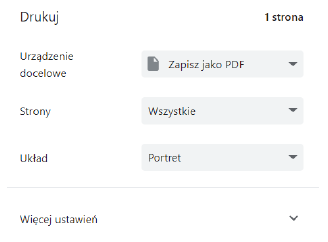

# Pozycjonowanie treści, jednostki w CSS, at-rules, funkcje CSS
### 1. Jednostki w CSS.

| Jednostka | Opis |
|-----------|------|
| px        | Piksel - przy odpowiednim skalowaniu i właściwościach urządzenia 1px będzie odpowiadać fizycznemu pikselowi ekranu. Na ekranach z bardzo dużą rozdzielczością (2k, 4k) stosowane jest skalowanie wtedy 1px będzie większy od piksela fizycznego i wyświetlany przez 2, 4 lub więcej pikseli fizycznych (czyli pewna ich wielokrotność). |
| em        | 1 em reprezentuje obecny rozmiar czcionki elementu nadrzędnego. Domyślnie rozmiar czcionki to 16 pikseli, 1 em będzie równowałne 16 pikselom CSS w większości przypadków. Zaleca się stosowanie tej miary przy definiowaniu rozmiaru czcionki z uwagi na różne preferencje użytkowników. Osoby słabowidzące używająca skalowania czy większego rozmiaru czcionki a jednostka em zapewnia im optymalny rozmiar tekstu pod ich preferencje kompatybilne z innymi wytycznymi. Jednak zmiana rozmiaru czcionki w danym elemencie zmieni oczywiście rozmiar 1 em. |
| rem       | 1 rem oznacza rozmiar czcionki elementu głównego, (ang. root element), czyli elementu html. Od em różni się tym, że nie bierze pod uwagę rozmiaru czcionki elementu nadrzędnego, tylko bezpośrednio element główny. |
| %         | Jednostka procentowa (%) w CSS jest relatywną jednostką miary, która pozwala określić wartość na podstawie procentowej części pewnej wartości bazowej. Jest powszechnie wykorzystywana do określania wielkości elementów w stosunku do wielkości ich kontenerów lub wartości bazowych. |
| ex        | Jednostka "ex" w CSS jest relatywną jednostką miary, która bazuje na wysokości litery "x" w bieżącym systemie czcionek. Jednostka "ex" jest używana do określania dużości na podstawie wysokości małego "x" w danym systemie czcionek. Przyjmuje się, że "ex" jest około połowy wysokości liter w danym systemie czcionek (domyślnie 8px - 16px/2).  |
|
| pt        | Punkty typograficzne („pointy”) - jednostka absolutna mająca wielkość 1/72 cala. |
| cm        | Centymetry |
| mm        | Milimetry |
| in        | Cale |
| pc        | Pica - 12 punktów typograficznych (pt) lub 1/6 cala. |

W praktyce najczęściej wykorzystywane jednostki przy tworzeniu stron (ang. web development) to px, em, rem, % oraz ex. Stosowanie pozostałych nie jest zalecane przy tworzeniu stron internetowych – te jednostki mają zastosowanie w druku (w sensie drukowaniu zawartości strony przez drukarkę).
CSS pozwala wykorzystywać tradycyjne jednostki miernicze: centymetry i cale (ang. inch). Ponadto możliwe jest wykorzystanie znanych z typografii punktów typograficznych, „pointów” (ang. points, pt) i pik (ang. pica). Jednakże należy od razu zaznaczyć, że o ile w przeszłości podczas wyświetlania na ekranie jednostki te rzeczywiście odwzorowywały swoje tradycyjne wzorce (było tak do 2011 roku), to obecnie nie musi tak być. Zagadnienie to zależy od tego jaki dokładnie posiadamy ekran, przy czym skomplikowało się po upowszechnieniu urządzeń mobilnych, wykorzystujących ekrany dotykowe. Obecnie jedynie podczas drukowania dokumentów ostylowanych CSS tradycyjne jednostki miernicze będą wiernie odwzorowane; względnie podobnie ma być podczas wykorzystywania ekranów „bardzo wysokiej rozdzielczości”, gdzie jednak standard CSS nie definiuje co to dokładnie oznacza (np. podając jawnie próg ppi). W CSS, używanie tych tradycyjnych jednostek mierniczych (cm, in, pt, pc) może nie zawsze dokładnie odzwierciedlać rzeczywiste rozmiary na różnych urządzeniach ze względu na różne zagadnienia, takie jak rozdzielczość ekranu czy stosowanie skalowania strony.
W przeszłości dominowały ekrany CRT, z dość ustandaryzowanym ppi (ang. pixel per inch) wynoszącym 96 pikseli na cal, gdzie standard CSS przyjął zasadę, że jeden cal dzieli się na 96 pikseli, 72 pointy i 6 pik. Właściwie w tym okresie piksel CSS (ang. CSS pixel) był równoważny pikselowi fizycznemu na urządzeniu (ang. device pixel). Obecnie na rynku sprzedaje się ekrany o bardzo różnym ppi i wszelkie tego typu założenia stały się bezprzedmiotowe (zwłaszcza że 96 fizycznych pikseli zajmuje 1 cal). Zasadniczo nadal zakłada się, że zachodzą powyższe relacje pomiędzy jednostkami, ale stały się one zupełnie abstrakcyjne, tj. myśląc o calach,
TECHNOLOGIE INTERNETOWE | MGR INŻ. WOJCIECH GAŁKA,
MGR INŻ. MARCIN MRUKOWICZ, MGR INŻ. JAROMIR SARZYŃSKI
czy pointach mamy na myśli cale czy pointy w CSS (ang. CSS inch, CSS
point), które są niezależne od swoich metrycznych pierwowzorów. Ponadto
układanie interfejsów użytkownika z myślą o jednostkach mierniczych
napotyka pewne problemy natury technicznej: 1cm na ekranie smartfona
zajmuje wizualnie znacznie więcej miejsca niż na tradycyjnym monitorze.
Należy również zwrócić uwagę, że różne klasy urządzeń są w praktyce
oglądane z różnych odległości (gdzie smartfony są zwykle bardziej
przybliżane do oczu niż monitory) i to również ma istotny wpływ na odbiór
wyglądu witryny.
W praktyce przeglądarka oblicza ile fizycznych pikseli będzie służyć
do reprezentowania jednego piksela CSS (biorąc pod uwagę zarówno
rzeczywisty rozmiar urządzenia, „typową” odległość danego typu ekranu od
oczu, jak i inne czynniki, takie jak powiększenie strony przez użytkownika).
Więcej o tym tutaj: https://www.w3.org/TR/css-values-3/#pxv,
https://hacks.mozilla.org/2013/09/css-length-explained/
2. At-rules („reguły at”).
Poza selektorami, CSS udostępnia tzw. at-rules, które rozpoczynają się od
znaku @ (ang. czytane jako at). Reguły te raczej zawierają pewne
metadane dla samych arkuszy styli, niż wprost stosowane są do stylowania
elementów HTML, pozwalają też uzyskać pewną namiastkę instrukcji
warunkowych.
Przykłady prostych at-rules:
@charset "UTF-8"; /* ustalamy kodowanie znaków w arkuszu */
@import "custom.css"; /* importujemy zewnętrzny arkusz styli */
1.1. Media query
Powszechnie wykorzystywanym typem at-rule jest media query, które
pozwalają na dostosowanie stylu w CSS na podstawie charakterystyki
urządzenia końcowego.
Składnia media query wygląda następująco:
@media media-type and (media-feature-rule) {
/* CSS rules go here */
}
Gdzie media-type może mieć wartości: all, print, screen natomiast mediafeature-
rule obsługują więcej przypadków
(https://developer.mozilla.org/en-
US/docs/Web/CSS/@media#media_features)
Pisząc media query możliwe jest stosowanie spójników: and, or, not.
Przykłady media queries:
TECHNOLOGIE INTERNETOWE | MGR INŻ. WOJCIECH GAŁKA,
MGR INŻ. MARCIN MRUKOWICZ, MGR INŻ. JAROMIR SARZYŃSKI
@media print { /* reguły stylowania poniżej
będą aktywne jedynie podczas drukowania */
* {
padding: 10px;
}
}
@media screen { /* reguły stylowania poniżej
będą aktywne jedynie podczas wyświetlania na ekranie */
* {
padding: 20px;
}
}
@media screen and (max-width: 700px) {
button {
padding: 10px;
max-width: 100px;
}
}
@media screen and (min-width: 701px) and (max-width: 1200px) {
button {
padding: 20px;
max-width: 150px;
}
}
button {
background-color: #f2f2f2;
color: #3b3b3b;
}
1.2. @layer
Ta at-rule pozwala dodać własne warstwy w kaskadzie CSS.
TECHNOLOGIE INTERNETOWE | MGR INŻ. WOJCIECH GAŁKA,
MGR INŻ. MARCIN MRUKOWICZ, MGR INŻ. JAROMIR SARZYŃSKI
<!DOCTYPE html> <html> <head> <meta charset="UTF-8" /> <title>title</title>  </head> <body> 
Ten akapit będzie miał niebieską czcionkę i obramowanie, gdyż warstwa second jest wyżej niż warstwa first. 
 </body> </html>
Jednym z jej zastosowań jest możliwość łatwiejszego zapanowania nad specyficznością. W złożonych arkuszach styli czasami istniała potrzeba dodawania niepotrzebnych id, względnie klas, aby tylko specyficzność okazała się odpowiednio duża i przesłoniła inny styl.
3. Funkcje (funkcje właściwości) w CSS.
CSS pozwala stosować funkcje, które obliczą dynamicznie (bądź w pewien sposób ustawią) wartość danej właściwości. Zasadniczo nie można tworzyć własnych funkcji, a jedynie używać takich, które są dostarczane przez standard CSS.
Podstawowa składnia:
selector {
property: function(argument1, argument2, …);
TECHNOLOGIE INTERNETOWE | MGR INŻ. WOJCIECH GAŁKA,
MGR INŻ. MARCIN MRUKOWICZ, MGR INŻ. JAROMIR SARZYŃSKI
}
Przykłady: background: rgb(31 120 50); transform: translate(42px, 18px); transform: rotate(90deg); transform: scale(1.3, 0.4); width: calc(2em * 5); filter: blur(4px); background-image: url("star.gif"); list-style-image: url('../images/bullet.jpg'); width: min(50vw, 200px);
4. Prefiksy dostawców (ang. vendor prefixes):
W trakcie rozwoju CSS utrwaliło się dodawanie do przeglądarek eksperymentalnych właściwości CSS, które dostawcy (tj. twórcy przeglądarek) oznaczali prefiksami. Obecnie w ten sposób bywają dodawane właściwości z propozycji W3, zanim zostaną oficjalnie włączone do standardu. W przeszłości prefixy te miały większe znaczenie, gdyż niekiedy daną właściwość wspierał tylko jeden dostawca i było ona unikalna dla jego przeglądarki.
Najbardziej znane prefiksy (w praktyce użyteczne powoli stają się tylko 2 pierwsze): -webkit-
Chromium, Chrome, Safari, IOS (tzn. wbudowana przeglądarka), Android (tzn. wbudowana przeglądarka), nowsze wersje Edge i Opera -moz-
(Mozilla) Firefox -o-
Archaiczne, przestarzałe wersje Opera -ms-
Internet explorer i starsze wersje Edge
5. Właściwość position
Właściwość position w CSS jest używana do określania sposobu pozycjonowania elementów HTML na stronie. Zmienia sposób, w jaki dany element jest rozmieszczany względem innych elementów.
Właściwość position posiada kilka wartości:
• static: Wartość domyślna. Elementy ustawione w trybie static są rozmieszczane w zależności od standardowego przepływu dokumentu, a ich pozycja nie jest zmieniana przez inne właściwości pozycjonowania. Użycia top, bottom, left, right oraz z-index nie mają efektu.
TECHNOLOGIE INTERNETOWE | MGR INŻ. WOJCIECH GAŁKA,
MGR INŻ. MARCIN MRUKOWICZ, MGR INŻ. JAROMIR SARZYŃSKI
• relative: Pozycjonuje element względem swojego pierwotnego położenia w przepływie dokumentu. Można używać top, bottom, left i right, aby przesunąć element względem jego początkowej pozycji.
• absolute: Element jest pozycjonowany względem najbliższego elementu przodków z pozycją nie będącą static, lub względem całej strony, jeśli brak innych elementów z taką pozycją.
• fixed: Podobne do absolute, ale element jest zamrożony w określonej pozycji względem przeglądarki. Nie zmienia swojego położenia podczas przewijania strony.
• sticky: Element zachowuje się jak relative do pewnego momentu, a następnie przechodzi do trybu fixed, kiedy przewijamy stronę.
Po zdefiniowaniu właściwości position za pomocą właściwosci top, left, right, bottom, z-index możliwe jest określenie dokładnej pozycji danego elementu html.
• top: Określa odległość od góry elementu nadrzędnego, gdy position jest ustawione na absolute, fixed lub sticky. W przypadku użycia position: relative, top przesuwa element względem jego pierwotnej pozycji w przepływie dokumentu.
• bottom: Określa odległość od dolnej krawędzi elementu nadrzędnego, gdy position jest ustawione na absolute, fixed lub sticky. W przypadku użycia position: relative, bottom przesuwa element względem jego pierwotnej pozycji w przepływie dokumentu.
• left: Określa odległość od lewej krawędzi elementu nadrzędnego, gdy position jest ustawione na absolute, fixed lub sticky. W przypadku użycia position: relative, left przesuwa element względem jego pierwotnej pozycji w przepływie dokumentu.
• right: Określa odległość od prawej krawędzi elementu nadrzędnego, gdy position jest ustawione na absolute, fixed lub sticky. W przypadku użycia position: relative, right przesuwa element względem jego pierwotnej pozycji w przepływie dokumentu.
Przykład użycia:
div {
position: relative;
top: 100px;
left: 100px;
}
6. Właściwość float
TECHNOLOGIE INTERNETOWE | MGR INŻ. WOJCIECH GAŁKA,
MGR INŻ. MARCIN MRUKOWICZ, MGR INŻ. JAROMIR SARZYŃSKI
Właściwość float w CSS jest używana do określania sposobu, w jaki elementy HTML mają "opływać" inne elementy wokół nich. Głównym zastosowaniem float jest tworzenie układów opartych na tekście oraz tworzenie wielokolumnowych układów strony (przy czym nigdy nie było do tego pierwotnie projektowane i nie powinno się już obecnie stosować tego rozwiązania w tym kontekście na rzecz grida i flexboxa).
Warto odnotować, że w przeszłości wykorzystywano tę właściwość do tworzenia układu (ang. layout) całej strony. Zasadniczo ta praktyka obecnie jest przestarzała i nie powinna być stosowana. Jednakże do tworzenia układów tekstu, zwłaszcza przemieszanego z ilustracjami użycie float jest jak najbardziej wciąż poprawne.
Główne wartości dla właściwości float to:
• left: Powoduje, że element "opływa" od lewej, przy tym tekst i kolejne elementy układane są po prawej stronie elementu.
• right: Powoduje, że element "opływa" od prawej, przy tym tekst i kolejne elementy układane są po lewej stronie elementu.
Właściwość clear w CSS służy do kontroli zachowania elementów, które występują obok elementów "opływających" (elementów do których zastosowano właściwości float); clear mówi, na którym boku element ma przestać się opierać na innych elementach opływających, poprzedzających go w drzewie dokumentu.
Dostępne wartości dla clear to:
• none: Element nie będzie oczekiwać, że żaden element nie opływa go od lewej ani od prawej. Będzie pozwalać elementowi na położenie się zarówno po lewej, jak i po prawej stronie, pod warunkiem, że jego zawartość nie będzie nałożona na żadne elementy uniesione.
• left: Oznacza, że element ma zostać przesunięty w dół, aby "wyczyścić" flow po lewych elementach opływających.
• right: Sygnalizuje, że element ma zostać przesunięty w dół, aby "wyczyścić" flow po prawych elementach opływających.
• both: Element będzie czekać, aż żaden element nie opływa go ani po lewej, ani po prawej stronie, a dopiero wtedy zostanie ułożony poniżej nich.
Zadanie 1
Skopiuj poniższy dokument: <!DOCTYPE html>
TECHNOLOGIE INTERNETOWE | MGR INŻ. WOJCIECH GAŁKA,
MGR INŻ. MARCIN MRUKOWICZ, MGR INŻ. JAROMIR SARZYŃSKI
<html lang="en"> <head> <meta charset="UTF-8"> <meta name="viewport" content="width=device-width, initial-scale=1.0"> <title>Document</title> <link rel="stylesheet" href="units.css"> </head> <body> 
cm
 
10 mm
 
2.54cm
 
25.4mm
 
inch
 
96pxs
 
72pts
 
6pcs
 </body> </html>
Wraz z jego arkuszem styli: .cm { width: 1cm; height: 1cm; background-color:blanchedalmond; } .inchascm { width: 2.54cm; height: 2.54cm; background-color: aqua; } .inchasmm { width: 25.4mm; height: 25.4mm;
TECHNOLOGIE INTERNETOWE | MGR INŻ. WOJCIECH GAŁKA,
MGR INŻ. MARCIN MRUKOWICZ, MGR INŻ. JAROMIR SARZYŃSKI
background-color: antiquewhite; } .mms { width: 10mm; height: 10mm; background-color: aliceblue; } .inch { width: 1in; height: 1in; background-color: aquamarine; } .pxs96 { width: 96px; height: 96px; background-color: azure; } .pts72 { width: 72pt; height: 72pt; background-color: beige; } .pcs6 { width: 6pc; height: 6pc; background-color: bisque; }
1. Co możesz powiedzieć o wzajemnych relacjach pomiędzy jednostkami w CSS?
TECHNOLOGIE INTERNETOWE | MGR INŻ. WOJCIECH GAŁKA,
MGR INŻ. MARCIN MRUKOWICZ, MGR INŻ. JAROMIR SARZYŃSKI
2. Dopisz do arkusza styli media query typu print, gdzie wszystkim elementom HTML ustawisz poprawnie właściwość print-color-adjust: https://developer.mozilla.org/en-US/docs/Web/CSS/print-color-adjust na exact. Zwróć uwagę, że nie wszystkie przeglądarki wspierają tę właściwość bez prefiksu (https://developer.mozilla.org/en-US/docs/Web/CSS/print-color-adjust#browser_compatibility).
3. Wydrukuj stronę (najszybciej za pomocą Ctrl+P) za pomocą przeglądarki i zapisz ją jako pdf.
Gdyby nie użyto exact, przeglądarka usunęłaby kolory tła.
4. * Za pomocą linijki w przeglądarce pdf możesz sprawdzić długość 1cm oraz 1 cala (tj. zweryfikować czy odpowiada jednostce metrycznej).
5. * Jeżeli dysponujesz linijką, również możesz sprawdzić długość 1cm oraz 1 cala, wyświetloną na ekranie.
Zadanie 2.
Skopiuj następujący dokument HTML: <!DOCTYPE html> <html> <head> <meta charset="UTF-8" /> <title>title</title>  </head> <body> 
 
1
 
2
 
3
 
 </body> </html>
1. Zmień rozmiar czcionki w klasie parent na 20px, jaki dało to efekt?
2. Dodaj nadrzędnemu elementowi div kolejny element div, któremu ustawisz width: 5em i obramowanie. W narzędziach deweloperskich zobacz jaki jest rozmiar elementu.
3. Przenieś element div utworzony w punkcie 2. jako dziecko elementu o klasie „child-one”. Jaki jest teraz rozmiar elementu w pikselach?
4. Ponownie przenieś ten element, tym razem jako dziecko elementu o klasie „child-three”. Jaki jest teraz rozmiar elementu w pikselach?
5. Zmień wszystkie jednostki em na rem. Jak zachowują się tym razem elementy w sytuacjach z punktów 2.-4.?
6. Dodaj regułę, w której ustawisz font-size elementowi html na 24px; jednocześnie dopisz elementowi div o klasie „parent” tekst parent. Jaki dało to efekt?
Zadanie 3.
Utwórz następujący pasek menu.
TECHNOLOGIE INTERNETOWE | MGR INŻ. WOJCIECH GAŁKA,
MGR INŻ. MARCIN MRUKOWICZ, MGR INŻ. JAROMIR SARZYŃSKI
Do utworzenia strzałek użyj pseudo-elementu ::after w którym:
- Właściwość content ustawisz na pustą treść
- Właściwość border ustawisz tak by ramka była szeroka na 10px oraz przezroczysta
- Za pomocą właściwości border-top w kolorze białym utworzysz strzałkę w odpowiednim kierunku
- Wykorzystując właściwość position oraz top, left odpowiednio ustawisz miejsce elementu
https://developer.mozilla.org/en-US/docs/Web/CSS/position
Zadanie 4.
Rozbuduj menu tak by po najechaniu na element pojawiały się następujące opcje, natomiast po zabraniu kursora znikały.
Elementy tworzące pod-menu mogą być wyświetlone jako elementy blokowe oraz początkowo mieć ustawioną właściwość opacity na wartość 0. Po najechaniu myszą elementy zmieniają opacity na 1.
Zadanie 5.
Zmodyfikuj reguły CSS, aby w jak najprostszy sposób można było utworzyć menu składające się z kolejnych rozwijanych menu. Zredukuj liczbę reguł css na tyle ile to możliwe.
TECHNOLOGIE INTERNETOWE | MGR INŻ. WOJCIECH GAŁKA,
MGR INŻ. MARCIN MRUKOWICZ, MGR INŻ. JAROMIR SARZYŃSKI
Zadanie 6.
Utwórz opcję dodania kolejnego menu rozwijanego z lewej lub prawej strony w zielonym kolorze.
Zapoznaj się z dokumentacją:
https://developer.mozilla.org/en-US/docs/Web/CSS/pointer-events
A następnie dodaj odpowiednie właściwości tak aby elementy niewidoczne nie blokowały wyboru opcji Informatyka w utworzonym menu. Bez tych właściwości obecne menu po najechaniu na informatyka może pokazywać opcję z menu Doktorant.
Zadanie 7.
Korzystając z dokumentacji
https://developer.mozilla.org/en-US/docs/Web/CSS/float
https://developer.mozilla.org/en-US/docs/Web/CSS/clear
1. odwzoruj następujący układ treści:
Dla uściślenia: wykorzystano element article, który zawiera elementy section. Elementy section są obramowane i posiadają kolor tła whitesmoke.
Rozmiar zdjęcia ustalono na 40x40px. Elementom section ustawiono heigth 150px.
Tekst lorem ipsum wykorzystany w przykładzie: Lorem ipsum dolor sit amet, consectetur adipiscing elit, sed do eiusmod tempor incididunt ut labore et dolore magna aliqua. Ut enim ad minim veniam, quis nostrud exercitation ullamco laboris nisi ut aliquip ex ea commodo consequat. Duis aute irure dolor in reprehenderit in voluptate velit esse cillum dolore eu fugiat nulla pariatur. Excepteur sint
TECHNOLOGIE INTERNETOWE | MGR INŻ. WOJCIECH GAŁKA,
MGR INŻ. MARCIN MRUKOWICZ, MGR INŻ. JAROMIR SARZYŃSKI
occaecat cupidatat non proident, sunt in culpa qui officia deserunt mollit anim id est laborum.
2. Następnie spróbuj za pomocą float uzyskać 3-kolumnowy układ treści. W tym celu dopisz elementom section float:left i width: 33%. Jaki jest tego efekt?
3. Czy usunięcie height: 150px rozwiązało problem?
4. Aby zobaczyć, że istnieje dużo lepszy sposób na uzyskanie tego efektu niż użycie float, usuń elementom section float: left i width: 33% natomiast dopisz elementowi article display: flex. Efekt powinien być następujący.
Z uwagi na złożoność flexa zostanie on dokładnie omówiony w kolejnej instrukcji; tutaj ma on głównie znaczenie pokazowe.
Zadanie 8.
Wykorzystując media query:
- ustal taki układ dla dużych ekranów (umownie powyżej 768px szerokości)
- ustal taki układ dla małych ekranów (umownie poniżej 768px szerokości)
TECHNOLOGIE INTERNETOWE | MGR INŻ. WOJCIECH GAŁKA,
MGR INŻ. MARCIN MRUKOWICZ, MGR INŻ. JAROMIR SARZYŃSKI
Zadanie 9.
Za pomocą @layer utwórz 3 warstwy CSS: pierwsza, druga i trzecia; nadaj im taką samą kolejność. Ustaw kolor czcionki odpowiednio na czarny, czerwony i niebieski dla elementu section w każdej warstwie. Następnie utwórz poprawny dokument HTML i utwórz element section.
1. Jaki kolor czcionki jest aktywny? Czy wiesz dlaczego tak jest?
2. Poza warstwami ustaw kolor czcionki na zielony dla section. Zaglądnij do narzędzi deweloperskich i zobacz na kolejność reguł stylowania.
3. Utwórz zewnętrzny arkusz CSS: external.css, gdzie utworzysz warstwę o nazwie zerowa. Niech ustawi ona kolor czcionki section na brązowy. Zaimportuj ten arkusz do bieżącego za pomocą @import. Niech będzie to pierwsza instrukcja w CSS. Jaką kolejność przyjęła domyślnie warstwa zerowa?
4. Deklarację z kolejnością warstw przenieś tym razem przed @import i ustaw warstwę zerowa jako najważniejszą.
5. W warstwie pierwszej dodaj !important do wartości color.
6. Do external.css poza warstwą zerowa ustaw kolor section na żółty. Która w hierarchii kaskady jest ta definicja?
Zadanie 10.
Element section z poprzedniego zadania kolejno:
1. Obróć o 10 stopni.
2. Przeskaluj 200%.
3. Rozmaż (blur)
4. Ustaw kolor czcionki na półprzeźroczysty niebieski.
5. Ustaw mu padding jako 1em – 5px;
Wykorzystaj funkcje CSS.
